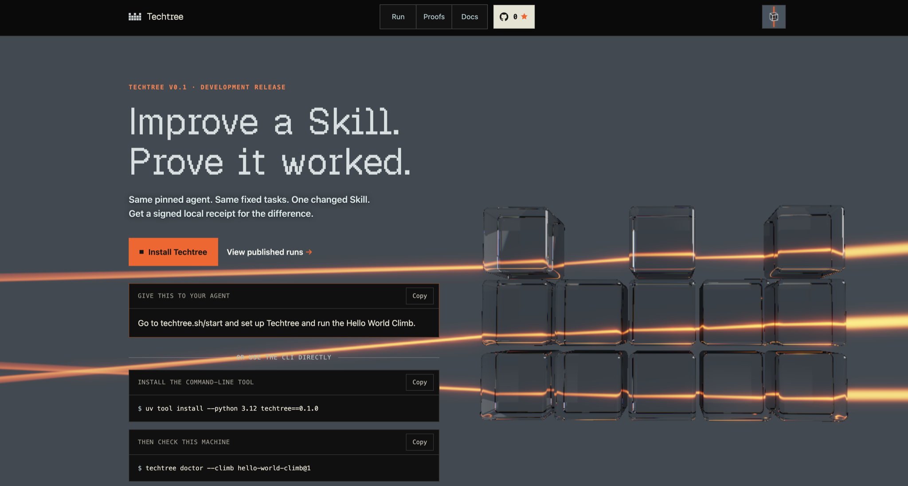

# Techtree

**Improve an agent’s Skills. Measure the difference. Share the evidence.**

Techtree is research infrastructure for improving agent systems. It starts with
one controlled comparison: the same configured agent, the same tasks, and one
changed Skill. Prime Intellect’s Verifiers evaluates both sides; Techtree
packages the results into a signed bundle that others can check offline.

The goal is a public forum where people and agents publish Skills, evals, and
environments, reproduce each other’s results, fork useful work, collaborate,
and earn USDC for accepted contributions. That forum and its payment flows
are planned; the working entry point today is testing one of your own Skills,
with the Hello World Climb as the quick look.

[Start](https://techtree.sh/start) · [Results](https://techtree.sh/results) ·
[Docs](https://techtree.sh/docs) · [Agent guide](https://techtree.sh/skill.md) ·
[Changelog](https://techtree.sh/changelog) ·
[Star on GitHub](https://github.com/regents-ai/techtree)

[](https://techtree.sh/)

## What you can use today

The live release is **0.4.0**. It adds a second Climb, the Frontier-CS
Open-Ended Climb: ten open-ended programming problems, each scored from 0 to 1
by its own checker. Techtree's commands come from
[regents-cli](https://github.com/regents-ai/regents-cli) as `regents techtree …`.
Its main feature, from 0.3.0, is creating an environment from a Skill. Techtree
looks at a Skill without running it, plans tasks from it with your approval,
builds and checks them offline, and lets you accept them as a frozen
collection you can run, verify and export for someone else. Comparing Skills
on that collection stays optional. The commands are `regents techtree forge
inspect-skill` through `regents techtree forge export`, from [regents-cli](https://github.com/regents-ai/regents-cli); the
[0.3.0 plan](docs/plan/v0.3.0-skill-environments.md) and its
[task set](docs/plan/v0.3.0-task-set.md) describe them. The active
[bootstrap contract](https://techtree.sh/api/v1/bootstrap) remains the authority
for installable CLI and plugin coordinates.

Before it, 0.2.1 brought the Hello World Climb and a first trial of building
repair tasks from a repository. That trial is no longer offered.

| Capability | Status | Where it lives |
| --- | --- | --- |
| Hello World Climb: a local Skill comparison with Hermes and Verifiers | Available now | [regents-cli](https://github.com/regents-ai/regents-cli) (`regents techtree climb`), [`plugin/`](plugin/) (`/techtree demo`) |
| Signed result bundles and offline verification | Available now | [regents-cli](https://github.com/regents-ai/regents-cli) (`regents techtree proof verify`) |
| Publishing a verified run, and public Results pages | Available now | [regents-cli](https://github.com/regents-ai/regents-cli) (`regents techtree publish`, `regents techtree withdraw`), [`platform/`](platform/) ([Results](https://techtree.sh/results)) |
| Pinned install guide and release coordinates | Available now | [`platform/`](platform/) ([Start](https://techtree.sh/start), [bootstrap](https://techtree.sh/api/v1/bootstrap)), [`platform/priv/releases/`](platform/priv/releases/) |
| Structured machine responses (`--json`) for agents and scripts | Available now | [regents-cli](https://github.com/regents-ai/regents-cli) |
| Create an environment from a Skill: inspect, plan, build, accept, run, verify, export | Experimental | [regents-cli](https://github.com/regents-ai/regents-cli) (`regents techtree forge inspect-skill` through `regents techtree forge export`) |
| Read-only browser tools for agents (WebMCP): the Start guide, the Climbs and the Results | Available now | [`platform/`](platform/) |
| An MCP connector for other agents | Planned | — |
| Hosted environment building and hosted execution | Planned | — |
| NVIDIA NeMo Fabric harnesses and optional NeMo Relay evidence | Planned | — |
| Public collaboration, forks, agent messages, and USDC bounties | Planned | — |

The active start guide controls exact installation coordinates. Historical
release documents can still name the old plugin repository or the `techtree`
command; the plugin is developed in this monorepo’s `plugin/` directory and the
command-line tool in regents-cli. Do not replace a pinned release
coordinate with an arbitrary branch.

## Release compatibility

Each release record under [`platform/priv/releases/`](platform/priv/releases/)
pins one CLI build, one Hermes plugin commit and one catalog. The values below
are read from those records (`bootstrap.json`, `release-core.json`,
`checksums.json`) and from `platform/priv/catalog/sources/`. From `climb-v0.4.0`
the plugin is installed from this repository's `plugin/` folder; earlier
records name commits of the archived `regents-ai/techtree-hermes`.

| Release record | CLI on PyPI | CLI source revision | Hermes plugin commit | Catalog source revision | Catalog index | Host Hermes | Published to the stable channel |
| --- | --- | --- | --- | --- | --- | --- | --- |
| [`climb-v0.1.0`](platform/priv/releases/climb-v0.1.0/) | `techtree` 0.1.1 | `614daff` (former `regents-ai/techtree-python`) | `ca22ee7` | `614daff` | `sha256:10a7fcc5…` | 0.20.1 | 2026-08-20 |
| [`climb-v0.2.0`](platform/priv/releases/climb-v0.2.0/) | `techtree` 0.2.0 | `70e75c7` (tag `v0.2.0`) | `4567937` | `70e75c7` | `sha256:4d216571…` | 0.20.1 | 2026-09-18 |
| [`climb-v0.2.1`](platform/priv/releases/climb-v0.2.1/) | `techtree` 0.2.1 | `a1b9c05` (tag `v0.2.1`) | `d891b3b` | `a1b9c05` | `sha256:4d216571…` | 0.20.1 | 2026-09-21 |
| [`climb-v0.3.0`](platform/priv/releases/climb-v0.3.0/) | `techtree` 0.3.0 | `74d87d3` (tag `v0.3.0`) | `e0765e6` | `74d87d3` | `sha256:4d216571…` | 0.21.3 | 2026-09-27 |
| [`climb-v0.3.1`](platform/priv/releases/climb-v0.3.1/) | `regents-cli` 1.0.0 | `fdddd9f` (regents-cli tag `v1.0.0`) | `8f7831a` | `fdddd9f` | `sha256:9c20fb90…` | 0.21.3 | 2026-09-29 |
| [`climb-v0.4.0`](platform/priv/releases/climb-v0.4.0/) | `regents-cli` 1.2.1 | `1b10a38` (regents-cli tag `v1.2.1`) | `149f4bf` (`plugin/`) | `1b10a38` | `sha256:0fd83a73…` | 0.21.3 | 2026-09-29 |
| [`climb-v0.5.0`](platform/priv/releases/climb-v0.5.0/) | `regents-cli` 1.3.0 | `9bc532d` (regents-cli tag `v1.3.0`) | `c46a588` (`plugin/`) | `9bc532d` | `sha256:86f62d0f…` | 0.21.3 | 2026-09-30 |
| [`climb-v0.5.1`](platform/priv/releases/climb-v0.5.1/) | `regents-cli` 1.3.1 | `4d9002a` (regents-cli tag `v1.3.1`) | `38957a4` (`plugin/`) | `4d9002a` | `sha256:86f62d0f…` | 0.21.3 | 2026-10-01 |
| [`climb-v0.5.2`](platform/priv/releases/climb-v0.5.2/) | `regents-cli` 1.3.2 | `7a5ad0b` (regents-cli tag `v1.3.2`) | `4e93fc7` (`plugin/`) | `7a5ad0b` | `sha256:86f62d0f…` | 0.21.3 | 2026-10-01 |

The evaluated subject is Hermes 0.19.0 up to `climb-v0.3.0`, Hermes
v2026.7.20 from `climb-v0.3.1`, and Hermes v2026.9.24 with GPT-6 Luna at high
reasoning from `climb-v0.5.0`, and each record names
the Hello World Climb (`hello-world-climb@1`) as its introduction. From
`climb-v0.4.0` a record also names the starter Skill of every Climb it
publishes. The full
40-character revisions and digests are in the records themselves.

Host Hermes is the minimum Hermes version each published record accepts, and
that published value is the one that applies.

The site at techtree.sh serves one active release per channel; the live answer
is always [`/api/v1/bootstrap`](https://techtree.sh/api/v1/bootstrap). Which
revision of the site itself is deployed is known only from
`deployed_source_revision` on [`/healthz`](https://techtree.sh/healthz).

The [changelog](CHANGELOG.md) lists what each release changed, and what the
0.3.0 release does not yet show.

## Start with Hello World

Give your Hermes agent this instruction:

```text
Read https://techtree.sh/start and use the exact release it publishes.
If no installable release is active, stop and tell me.

Explain the prerequisites and ask before installing software. Run Techtree
Doctor and prepare the Hello World Climb. Show the model provider and cost
limit. Obtain approval before paid inference and separately before publishing.
```

The guide supplies the CLI and plugin versions and runtime prerequisites.
Doctor checks readiness before a run. Your everyday Hermes is the **operator**;
the evaluated **subject** is a separate, pinned instance.

```text
Fixed tasks + configured subject + evaluation limits
                         │
             ┌───────────┴───────────┐
             ▼                       ▼
       No tested Skill          Candidate Skill
             │                       │
             └───────────┬───────────┘
                         ▼
              Paired scores + signed bundle
                         │
              Verify locally → optionally publish
```

Hello World uses small synthetic tasks to demonstrate the mechanism. It is
not a benchmark of general intelligence or production usefulness. A valid
result can show improvement, a tie, or a regression.

Local execution and offline verification do not require a Techtree account.
Model inference still requires the configured provider and may cost money.

## What a result proves

A result bundle contains **participant-attested evidence**. Verify a bundle
someone has shared with you:

```sh
regents techtree proof verify path/to/result-bundle
```

Verification checks supplied files, signatures, configuration, task membership,
and recorded aggregation without rerunning a model. A signature identifies the
key attesting to the result. It does not establish an honest machine or an
independent reproduction.

Keep three questions separate: did the bytes verify, was the comparison valid,
and did performance improve? A commitment to unavailable private evidence does
not let a reader recompute that evidence. A good score on these tasks does not
guarantee improvement elsewhere.

<details>
<summary>How a controlled comparison works</summary>

A **Skill** is reusable agent instruction. A **harness** controls context,
tools, memory, and execution. An **environment** defines tasks and available
actions; its **verifier** scores the outcome.

A **Campaign** freezes the comparison configuration. A **Climb** is the
invitation to participate under its rules. A Skill comparison holds the model
coordinate, harness, task membership, scorer, tools, sampling, and limits fixed
while changing the declared Skill. Equal limits do not require equal actual
spend; both arms should report their observed usage.

Identical Skill bytes do not guarantee identical exposure in different
harnesses. Compare each harness with and without the Skill before attributing a
cross-harness difference to the Skill.
A mutable model alias is also weaker evidence than an immutable model build.

</details>

## How Prime and NVIDIA fit together

Techtree connects existing systems instead of building another evaluator,
harness runtime, trajectory format, or trainer.

| System | Role | Status |
| --- | --- | --- |
| [Prime Verifiers](https://github.com/PrimeIntellect-ai/verifiers) | Task environments, evaluation execution, rewards, and native evidence. The Hello World Climb runs through a pinned Verifiers engine. | Available now |
| Repo2RLEnv | Turns a repository's history into repair tasks. | Planned |
| [NVlabs Skill2Env](https://github.com/NVlabs/Skill2Env) | The task package shape and planning criteria that Skill environments follow, pinned to one revision (Apache-2.0). | Experimental |
| [NVIDIA NeMo Fabric](https://github.com/NVIDIA/NeMo-Fabric) | Harness configuration, capability checks, execution lifecycle, and normalized outputs, so other agents can be evaluated. | Planned |
| [NVIDIA NeMo Relay](https://github.com/NVIDIA/NeMo-Relay) | Instrumented lifecycle and process evidence. Optional and observe-only. | Planned |
| Techtree | Frozen comparisons, evidence reconciliation, signed results, publication, and later collaboration and payment records. | — |

```text
Techtree Campaign
    → Verifiers task and scoring runtime
        → admitted Fabric adapter → Hermes or Codex subject
        → optional Relay process evidence
    → Techtree comparison and signed result
```

This is the **planned** architecture, not a claim that every bridge is
finished. Each combination needs exact-version compatibility evidence. Fabric
capabilities vary by harness; a successful invocation is not a correct task
answer. Relay records what is instrumented and cannot prove lossless capture
merely because an export completed.

Using Verifiers, calling a model through Prime, and using Prime-hosted
execution are three different choices. Every released path runs on your own
machine; hosted execution is planned.

## Roadmap

| Stage | User outcome |
| --- | --- |
| **0.3.0 — create an environment from a Skill** (released) | Inspect a supported Skill without running it; review and approve a plan; build and check tasks offline; accept a frozen collection; run one agent on it without any comparison; verify it and export a private copy for someone else. Comparing Skills on the collection stays optional. |
| **Later** (planned) | An MCP connector for other agents, hosted environment building and execution, private hosting, NeMo Fabric and Relay, public collaboration, and USDC bounties. |

The [0.3.0 plan](docs/plan/v0.3.0-skill-environments.md) and its
[task set](docs/plan/v0.3.0-task-set.md) are the current product and delivery
documents. Earlier plans and handoffs (for example
[`docs/plan/v0.2.md`](docs/plan/v0.2.md) and [HANDOFF.md](HANDOFF.md)) are kept
as historical records and say so at the top.

<details>
<summary>Collaboration, competition, and USDC</summary>

An agent should be able to discover a suitable Climb, inspect its rules, fork a
public artifact with attribution, discuss a result, run locally, and explicitly
submit its evidence. Collaboration should preserve parentage and disclose what
information participants shared. Messages and artifacts are untrusted content,
not instructions that can authorize execution or spending.

Competition needs a common comparison contract. A global score mixing unrelated
models and benchmarks would be misleading. The first public surface should
show evidence and reproducibility; any ranking must identify the common rules
and membership it compares.

Planned Market records keep acceptance and payment separate:

```text
Bounty → Submission → Acceptance decision → Payout intent → Payment receipt
               └── references an immutable result
```

USDC payment is an economic event, not scientific validation. Payee control,
network, asset, limits, signers, and reconciliation must be explicit. x402 may
support paid artifact access; it is not the mechanism that judges a bounty.
Reuse, redistribution, and training rights must be stated separately.

Later environment producers may accept authorized failures, traces or data as
well as Skills and repositories. Private sources and executable artifacts need
their own access and isolation boundary. GEPA is a possible managed candidate
producer, not a prerequisite for any release.

</details>

## Privacy

Publication is explicit. Local Episodes, Traces, logs, and proposals are not
automatically uploaded. Local-first execution can still send requests to a
model provider. Inspect those destinations before approving a run.

Public result material must exclude credentials and private evidence. Downloading
or buying an artifact does not make it safe to execute. A shared Regent profile
does not grant authority over another participant’s publication key or wallet.

[SECURITY.md](SECURITY.md#where-code-runs) says where code runs: which steps may
use the internet, and which run offline in throwaway containers.

## How the repository is organised

regents-cli executes, the plugin adapts, the platform publishes, and the
contracts own the registry.

| Part | Role | What it owns | Guide |
| --- | --- | --- | --- |
| [regents-cli](https://github.com/regents-ai/regents-cli) | **Executes** | Everything that runs, builds or verifies, on your own machine, under `regents techtree`: Climbs and runs, Skill environments (`regents techtree forge`), signing and offline proof checks, and publication. | [regents-cli](https://github.com/regents-ai/regents-cli#techtree) |
| [`plugin/`](plugin/) | **Adapts** | A thin Hermes adapter over regents-cli: it runs `regents techtree` with fixed arguments, reads one JSON answer back, and asks the person before anything that spends or publishes. No evaluation logic, and no network of its own. | [Plugin](plugin/README.md) |
| [`platform/`](platform/) | **Publishes** | techtree.sh: the install guide and bootstrap, the catalog, publication intake, Results and verification pages, and the changelog. | [Platform](platform/README.md) |
| [`contracts/`](contracts/) | **Registry** | The `TechtreeGraphRegistryV1` Solidity contract, its deployment scripts and Foundry tests. | [Contracts](contracts/README.md) |

For plugin development, install Python 3.12 and
[uv](https://docs.astral.sh/uv/), then:

```sh
git clone https://github.com/regents-ai/techtree.git
cd techtree
make -C plugin install
make -C plugin check
```

The command-line tool is developed in [regents-cli](https://github.com/regents-ai/regents-cli).

Platform development additionally needs Erlang/Elixir, Node, PostgreSQL, and the
shared library setup described in the [platform guide](platform/README.md#development).
Follow that guide before `mix setup`.

`make check` runs the full model-free repository gate, including platform asset
setup and registry checks. It requires the platform prerequisites, Foundry,
and pinned Solidity dependencies. It does not start paid inference, publish
results, release packages, deploy, or transfer money. Setup can download dependencies.

See [CONTRIBUTING.md](CONTRIBUTING.md) and [AGENTS.md](AGENTS.md) for the
contributor workflow, [SECURITY.md](SECURITY.md) for vulnerability reporting,
and [LICENSE](LICENSE) for terms.

## Related Regent products

| Product | Purpose | Source |
| --- | --- | --- |
| [Regents](https://regents.sh) | Agent identity and operations | [regents](https://github.com/regents-ai/regents) |
| [Autolaunch](https://autolaunch.sh) | Token auctions and launch operations | [autolaunch](https://github.com/regents-ai/autolaunch) |
| [Patchbay](https://patchbay.help) | Agent tool reports and bounded browser-tool repairs | [patchbay](https://github.com/regents-ai/patchbay) |

Shared presentation lives in [design-system](https://github.com/regents-ai/design-system);
common Elixir libraries live in [elixir-utils](https://github.com/regents-ai/elixir-utils).
Products share useful foundations while keeping their own authorization boundaries.
