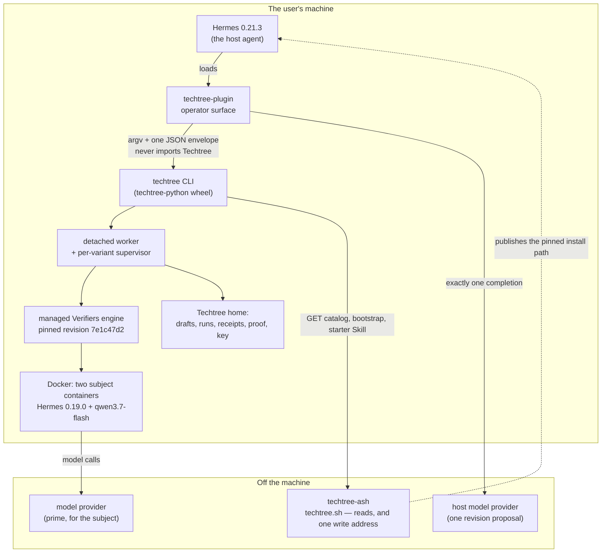
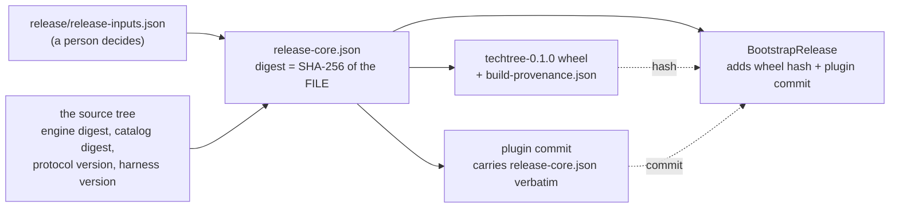
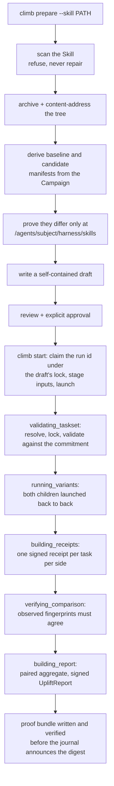
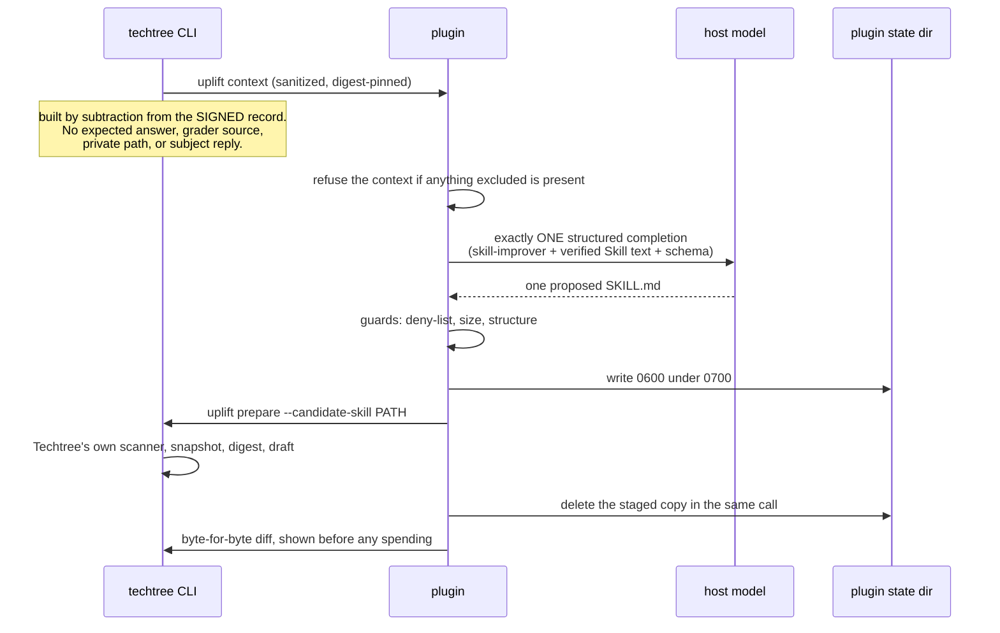
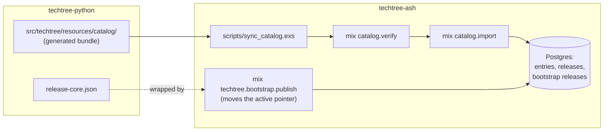

# Product and architecture — a handoff for a new engineer

Read this to learn **what Techtree Climb is**, **how the three codebases are
built**, and **how they fit together**. It is deliberately descriptive rather
than normative.

Two neighbouring documents do different jobs, and this one does not repeat
them:

- `docs/agent-handoff.md` — the current rules and state: binding sources,
  frozen digests, change discipline, invariants, release coordinates. When it
  and this document disagree about a *rule*, that one wins.
- `docs/spec/INDEX.md` — the ticket-to-spec-section map. When you need to know
  which specification section governs a piece of work, go there.

Everything below is checkable from the three checkouts. Every module named
exists. Digests, versions and coordinates change; verify them from artifacts
rather than from prose (here or anywhere else).

---

## 1. Product overview

### 1.1 What Techtree is

Techtree is **the open improvement and proof network for agent systems**.
Agents compete on executable environments; Skills and harnesses climb through
controlled trials; every improvement produces reproducible evidence.

**Techtree Climb v0.1 — "Techtree Hello World"** is the first slice of that,
and it is a *toy Skill-uplift Climb*. It exists to make one mechanism visible
and honest end to end, not to measure anything anybody should act on. It runs
the same pinned agent over the same fixed 36 synthetic tasks twice, changes
only the declared Skill, shows the measured difference, and leaves a signed
local receipt that can be checked offline.

### 1.2 The four-statement public promise

The whole product surface reduces to four statements (decision 0019 §3). Every
mechanism in all three repositories exists to make one of them true:

1. **Same agent and same tasks.** Same model, harness, runtime, task
   membership, tools, scorer and budget on both sides.
2. **The Skill was the only change.** First comparison: no tested Skill →
   Skill v1. Later: Skill v1 → Skill v2. The Skill is a content-addressed
   *tree*, not a single file.
3. **Here is the measured difference.** Baseline score, candidate score,
   absolute uplift, wins/losses/ties, cost, timing, regressions, validity.
4. **Here is the local receipt and how to verify it.** `techtree proof verify`
   — integrity-bound, participant-attested, offline-verifiable, and explicitly
   *not* independently reproduced.

The corollary is a design rule you will feel everywhere: an ordinary user
never has to meet a CampaignSpec, a TasksetLock, a receipt-set manifest,
canonical JSON, a signature envelope, or a journal event kind. Rigor stays
internal; the user experience stays almost trivial.

### 1.3 The vocabulary, as a user meets it

| Word | What it is to a user | Where it lives in code |
| --- | --- | --- |
| **Climb** | A public invitation: a slug, a title, a window, and the rules you are agreeing to. `hello-world-climb@1`. | `models/climb.py` (`ClimbManifest`), catalog |
| **Campaign** | The science behind a Climb: which tasks, which agent, which comparison rules, which budgets. Users never see it; every execution artifact points at it. | `models/campaign.py` (`CampaignSpec`) |
| **Skill** | A small tree of instruction text — `SKILL.md` plus optional `references/` and similar — that the evaluated agent is handed. Content-addressed. | `models/skill.py`, `skills/` |
| **Run** | One comparison: two variants executed, evidence retained, a report produced. Runs detached; survives the terminal closing. | `runs/`, `worker/` |
| **Receipt** | One signed record per task per side, saying what that task scored. | `models/episode_receipt.py`, `receipts/` |
| **Report** | The `UpliftReport`: the paired aggregate and the five statuses that qualify it. | `models/uplift_report.py`, `receipts/uplift.py` |
| **Proof** | A portable directory inside the run that holds the signed documents and can be checked offline with no network, no account and no service. | `receipts/bundle.py`, `receipts/verify.py` |

A **proof** makes a bounded claim, and the product says so in every channel:
this machine's own key vouches for bytes that verify against one another.
Nobody else witnessed the computation.

### 1.4 The two user journeys

**Agent-first (the reference path, decision 0024).** Someone who already uses
Hermes pastes one instruction into it. Hermes reads the pinned installation
guide at `techtree.sh/start`, explains prerequisites, commands, cost and
privacy, asks before installing anything, installs and enables the Techtree
Hermes plugin, tells the user to restart Hermes once, then — through the
plugin — offers to install the pinned Techtree CLI, runs Doctor, and starts
Hello World only after the paid-run approval.

**Direct terminal.** Someone installs the CLI themselves, runs
`techtree setup`, `techtree doctor --climb hello-world-climb@1`,
`techtree climb prepare`, reviews what the run would do, types `y`, and
watches it. Same runs, same receipts, same proof. The plugin is an operator
convenience, never a second evaluation path.

Both journeys hit the same four approvals: install software · first paid run ·
send the sanitized revision context to the host model provider · second paid
run after reviewing the diff.

### 1.5 What is deliberately *not* in v0.1

- **No accounts.** There is no Techtree account, no sign-in, no identity
  service. The only key involved is one this machine made for itself.
- **No uploads a person did not ask for.** Nothing leaves the machine unless
  somebody runs `techtree publish` on a finished run, and what travels then is
  that run's proof — the signed report and its receipts — and never the
  episodes, which are not in the proof directory at all. `push=false` is
  spelled as a type the config cannot hold otherwise
  (`verifiers/config.py`), so the evaluation engine's own uploader is off in
  every resolved configuration. The website has exactly one address that
  accepts anything, and what it accepts is a signed publication or withdrawal.
- **No leaderboards.** The Climb's leaderboard policy is `enabled: false`,
  `techtree-ash` runs no ranking of any kind, and the public run log orders
  entries by arrival and ranks nothing. Nothing establishes comparability
  between two people's runs.
- **No multi-file guided revision.** The guided revision proposes one
  `SKILL.md` (decision 0023 §4). Skills themselves are multi-file trees; the
  *guided* revision is not. Multi-file revision is deferred (ticket
  ndq.3.42).
- **No phone or iOS app.** Decision 0024 removed it. The compact renderer
  still exists for narrow channels, but no phone journey is claimed or
  certified.

Model inference still goes to the model provider you configured, under that
provider's policies. "Runs locally" is not "runs without the network", and the
copy is careful about that everywhere.

---

## 2. Tech stack

### 2.1 techtree-python — the CLI and evaluation substrate

| | |
| --- | --- |
| Language | Python 3.12–3.13 (`>=3.12,<3.14`); release journeys pin 3.12 |
| Packaging | `uv` for every workflow; `hatchling` build backend; wheel `techtree-0.1.0` |
| Runtime deps | `pydantic` v2 (protocol models), `typer` (CLI), `rich` (terminal rendering), `rfc8785` (canonical JSON), `cryptography` (Ed25519), `filelock`, `platformdirs`, `tomli-w` |
| Dev tooling | `ruff` (format + lint), `mypy --strict`, `pytest` with `pytest-xdist` and `pytest-cov` |
| Gates | `make check` = format-check, lint, typecheck, test, generated-check. Plus `make test-integration`. |

The ordinary package **never** depends on Verifiers, Hermes or NeMo Relay.
Those belong to the managed engine, which has its own interpreter, its own
`pyproject.toml` and its own `uv.lock` under
`src/techtree/resources/engines/default/`.

### 2.2 techtree-plugin — the Hermes operator plugin

| | |
| --- | --- |
| Language | Python 3.12+, **standard library only** at runtime |
| Distribution | Not a package. Hermes loads the repository directory itself; `[tool.uv] package = false` |
| Dev tooling | `ruff`, `mypy --strict` |
| Gates | `make check` here (format, lint, types); the *tests* run from techtree-python as `make test-plugin` |

The runtime never imports Techtree's Python package. The CLI's JSON envelope
is the only boundary, and `tools/plugin/plugin_doctor.py` fails the build if
either of those two facts stops being true.

### 2.3 techtree-ash — the website

| | |
| --- | --- |
| Language | Elixir ~> 1.15 (developed on 1.19.5 / OTP 28.2) |
| Framework | Phoenix 1.8.4 with LiveView 1.1, Bandit, `phoenix_html` |
| Data | Ash 3 + AshPostgres 2 over PostgreSQL 14+ |
| Assets | esbuild, hand-written CSS, no framework, no remote fonts |
| Deployment | Fly.io (`fly.toml`, app `techtree-sh`), multi-stage `Dockerfile`, OTP release with `bin/server` and `bin/migrate` overlays |
| Gates | `PGUSER="${PGUSER:-postgres}" mix check` — formatting, warnings-as-errors, tests |

### 2.4 The pinned external systems

These are the things the science depends on and the reason nothing here is
allowed to float:

- **Prime Verifiers engine** — pinned to revision
  `7e1c47d24d055aae587ee8259f77a3e8e193513a` (version `0.3.1.dev21`), Python
  3.12, carrying the `procedure-transfer-v1` reference package. The whole
  bundle is content-addressed and installed into
  `<techtree home>/engines/sha256-<hex>/`. Two field notes drive a lot of the
  integration code and are worth reading before touching it:
  `docs/verifiers-pin.md` and `docs/verifiers-eval.md`.
- **Docker subject containers** — the evaluated agent runs in a container the
  Campaign pins by index digest, with per-platform manifest digests recorded
  for `linux/amd64` and `linux/arm64`, `network_policy: restricted`, 2 CPU,
  4 GB. `verifiers/image.py` asks the local daemon what it actually holds
  rather than trusting the reference.
- **Subject model** — `qwen/qwen3.7-flash` via the `prime` provider,
  temperature 0, `max_tokens` 4096, credential named `PRIME_API_KEY` and
  resolved from an **active Prime CLI configuration** (`prime login`). An
  exported shell variable deliberately does not reach a detached run.
- **Host model for the guided revision** — the reference host is
  `z-ai/glm-5.2` with strict `json_schema`, one completion, no retries, no
  fallback (decision 0018). It is a *candidate producer*, never a Campaign
  component: it appears in operational records and provenance, never in the
  TasksetLock, the subject manifest, the comparison invariants or the reward
  contract.
- **Hermes** — host floor and ceiling `0.21.3`, installed with
  `plugins install --ref <full commit>`; Hermes scans the plugin's source
  before installing and shows the findings. The *evaluated subject* stays the
  separately pinned Hermes `0.19.0` named by the Campaign. Those two are not
  the same agent and must never be conflated.

---

## 3. File structure, repository by repository

### 3.1 techtree-python

```text
src/techtree/
├── canonical.py        RFC 8785 canonical JSON; the ONE place an object becomes
│                       bytes for hashing. Also the narrow Verifiers task-hash
│                       normalization boundary.
├── crypto.py           Ed25519 primitives only. Knows nothing about where keys
│                       live or when to sign.
├── ids.py              Prefixed local identifiers (run_…, draft_…). Labels, never
│                       integrity values.
├── constants.py        Values only; imports nothing, so anything may import it.
├── errors.py           The typed error taxonomy, each with a stable code, an exit
│                       code, retryability, and the repair actions to offer.
├── fs.py               Atomic writes, O_EXCL immutable writes, 0600/0700 privacy.
├── paths.py            Where the Techtree home is; creates nothing at import.
├── settings.py         config.toml plus TECHTREE_* overlay. Holds no secret.
├── harness.py          The pinned harness's tool-surface conformance fixture, so a
│                       moved harness pin fails instead of hiding inside "the Skill
│                       index changed".
├── version.py          Package / protocol / CLI-schema versions.
│
├── models/             The protocol kernel. Frozen, strict, extra-forbidden.
│   ├── base.py             ProtocolModel (frozen, hashable) vs StateModel (mutable).
│   ├── campaign.py         CampaignSpec — the scientific contract.
│   ├── climb.py            ClimbManifest + ResolvedClimb — the public wrapper and
│   │                       the assembled, cross-checked graph.
│   ├── data_policy.py      Rights, fixed before any episode exists.
│   ├── skill.py            SkillArtifact (content-addressed tree) + SubmissionDraft.
│   ├── experiment.py       ExperimentManifest ×2 and their comparison.
│   ├── validation.py       TasksetLock, TasksetValidationReceipt, execution record.
│   ├── episode_receipt.py  What one task produced.
│   ├── uplift_report.py    The result, with five separate statuses.
│   ├── run.py              RunRequest, RunPhase, RunEvent, RunState.
│   ├── evaluation_backend.py  Who orchestrated and whose word the result rests on.
│   ├── engine.py           The managed engine descriptor and host-platform vocabulary.
│   ├── catalog.py          Catalog index, Climb summary, compatibility result.
│   └── cli.py              CliEnvelope, CliError, NextAction.
│
├── catalog/            repository.py recomputes every digest before trusting a file
│                       and refuses paths that escape the root; service.py assembles
│                       Climb + Campaign + DataPolicy + validation receipt into one
│                       consistent story and reports whether you could run it here.
├── drafts/             store.py owns the draft directory (self-contained: everything
│                       needed to check the claim is copied in, nothing is left as a
│                       reference into the catalog); source.py is CampaignSource, the
│                       "with or without a public Climb" carrier.
├── manifests/          builder.py derives the two variants from one Campaign by
│                       copying deeply and deciding nothing; compare.py proves the
│                       two differ only at /agents/subject/harness/skills.
├── skills/             policy.py (what a Skill may be), scanner.py (refuses rather
│                       than repairs, and only on shape: symlinks, hidden files,
│                       binaries, size — never on what the Skill says),
│                       archive.py (deterministic tar and a safe extractor),
│                       service.py (directory → prepared submission, in an order
│                       where nothing lands until every check passed),
│                       starter.py (obtain the release's starter Skill and prove it).
├── tasksets/           resolver.py locks a taskset by inspecting it twice in fresh
│                       processes; membership.py turns that into an ordered hash
│                       commitment; verifiers_cli.py drives the pinned validator and
│                       refuses to read a verdict off an exit code; provider.py runs
│                       the real model-free validation; service.py compares identity
│                       and soundness.
├── engines/            bundle.py (what the engine is and what it hashes to),
│                       installer.py (uv sync --frozen; recorded installed only after
│                       the environment answers correctly), registry.py (which engine
│                       is active, addressed by digest), runner.py (absolute paths,
│                       minimal environment).
├── verifiers/          The real evaluation path.
│   ├── config.py           The allow-list of Verifiers settings Techtree may emit.
│   ├── compiler.py         Manifest → deterministic TOML; translation, no judgement.
│   ├── child.py            One live eval child: absolute executable, stdout to a
│   │                       file (never streamed — those are the subject's
│   │                       transcripts), gentle signals to the process group.
│   ├── supervisor.py       A process that outlives the worker, holding a pipe, a
│   │                       monotonic deadline and the eval's process group, so a
│   │                       hard-killed worker cannot orphan spending containers.
│   ├── credentials.py      Checks the evaluation credential without ever carrying it.
│   ├── budget.py           Refuses a Campaign whose declared limits are not
│   │                       enforceable, and computes the dollar bound before starting.
│   ├── image.py            Asks the daemon what it actually holds.
│   ├── progress.py         Counts completed episodes from traces.jsonl. Line position
│   │                       is never task position.
│   ├── outputs.py          The three files a real eval must leave behind.
│   ├── verify.py           The engine's own dry run, compared as a projection.
│   └── models.py           Local execution types and RunPaths.
├── runs/               events.py (append-only canonical journal), machine.py (pure
│                       state machine and projection), store.py (placement, locking,
│                       once-only writes), artifacts.py (run-owned inputs copied and
│                       re-verified), service.py (the start transaction),
│                       launcher.py (detached session leader, scrubbed environment),
│                       executor.py (the seam), fake.py (development executor whose
│                       output can never pass as evidence), real.py (the executor that
│                       measures), variants.py (both sides launched back to back),
│                       child_registry.py, validation.py.
├── worker/             main.py — one argument, no CLI apparatus; execute.py — the
│                       only code running in the detached process.
├── receipts/           episode.py (one receipt per committed task), set.py (ordered
│                       commitment per variant), observed.py (what the engine and the
│                       daemon actually did), compare.py (the two executions were one
│                       experiment), uplift.py (paired aggregate and the report),
│                       execution.py (timing and cost, orthogonal to reward truth),
│                       bundle.py (the portable proof), verify.py (offline check, in
│                       the specification's fixed order).
├── presentation/       models.py (the channel-neutral payload), build.py (signed
│                       report → payload, describing rather than deciding), rich.py
│                       (the terminal rendering), compact.py (the bounded rendering),
│                       evidence.py (reads model turns and provider refusals back out
│                       of the run's unsigned evaluation output, and only after
│                       checking those files against the fingerprints the signed
│                       record already committed — a file that is missing or altered
│                       yields no number rather than a zero), sanitize.py (enforces
│                       that no hidden answer, grader source, control sequence or
│                       private path can appear).
│                       Everything the screen adds beyond the signed report — the
│                       derived cost, the turn counts, the rate-limit tally — is
│                       computed at render time. The signed report, the receipts and
│                       the proof bundle are never rewritten to carry it.
├── uplift/             derive.py (turn a finished comparison into the next Campaign:
│                       exactly two things change), context.py (what a host agent may
│                       be told — built by subtraction from the signed record),
│                       public_tasks.py (per-taskset disclosure policy; absence is the
│                       safe answer), source.py (the run's own re-verified Skill text),
│                       service.py (the stage that closes a real run). The same four
│                       commands close a forge comparison through forge/improvement.py
│                       and forge/revision.py.
├── cli/                app.py (wiring and global options), context.py (machine mode
│                       is derived and implies --no-input), invoke.py (one envelope,
│                       one exit code, always), output.py (JSON to stdout, logs to
│                       stderr), commands/{setup,doctor,climb,skill,run,proof,uplift,
│                       engine,release}.py.
├── doctor/             checks.py (one function per thing that can be wrong; nothing
│                       raises), execution_checks.py (the narrower, expensive question:
│                       could the next real run execute here), service.py (order,
│                       blocking, and at most three repairs).
├── identity/           store.py (the one place a key lives, created exclusively),
│                       service.py (sign, and verify against a supplied key),
│                       models.py.
├── release/            models.py (ReleaseCore — every coordinate concrete),
│                       document.py (the one spelling and the file-bytes digest),
│                       generate.py (bind founder inputs to facts read out of the
│                       tree), checks.py (passed / failed / skipped, never two
│                       verdicts), bootstrap.py (check the website's wrapper from the
│                       producing end), provenance.py (read back the build stamp).
├── forge/              the local task forge (docs/plan/repo2rlenv-local-lane.md):
│                       bundle.py (the pinned Repo2RLEnv project, uv sync --frozen),
│                       generate.py (clone, bootstrap image, the driver), qualify.py
│                       (model-free control and reference grading of every task),
│                       content.py (complete task trees and ordered membership),
│                       experiment.py (one arm's run specification, declared from
│                       checked facts), comparability.py (may two arms be compared),
│                       run.py (one arm executed), compare.py (two arms paired),
│                       skill.py (the copy of the Skill a run or revision owns, read
│                       back verified), improvement.py (what a reviser may be told
│                       about a comparison), revision.py (one revised Skill, screened,
│                       measured against the same baseline, kept either way),
│                       source.py (a Source Skill looked at without running
│                       any of it, and its source record), planning.py (a
│                       planning approval, the one planner call and the
│                       proposal it answers with), construction.py (a
│                       construction approval, one creator call per proposed
│                       task and each package's import and qualification),
│                       authoring.py (what planning and construction share),
│                       collection.py (qualified tasks accepted as one frozen,
│                       versioned collection, and checked again),
│                       docker.py and process.py (the one command boundary).
└── resources/          catalog/, engines/default/, forge/, harness/, release/ — the
                        embedded, generated payload the wheel carries.
```

**Forge source (a Source Skill, looked at without running it).** `forge
inspect-skill PATH [--derived-from SOURCE_ID]` (`forge/source.py`,
`docs/plan/v0.3.0-skill-environments.md` U3a) is the first record of a
Skill-created environment. It lists every entry under the Skill's directory and
executes, follows and guesses nothing: a hidden path is recorded and never
opened (a hidden directory is one entry), a link is recorded and not followed,
anything but a regular file or readable directory is recorded as what it is,
and every regular file is hashed on the host. A file is `admitted` when it is
UTF-8 text with a suffix `skills/scanner.py` admits and within the per-file
limit; otherwise it is `unsupported` with a reason (`hidden`, `symlink`,
`special`, `unreadable`, `file_type`, `not_text`, `too_large`,
`case_collision`). A file is `required` when the instructions name it:
SKILL.md, and every path SKILL.md, or an admitted file it names, mentions as a
Markdown link target or a bare path (a directory only with its trailing
slash), followed through admitted text. A required file that is unsupported, a
link to a file that is not in the Skill or is outside it, a SKILL.md header
Techtree does not read, or more files or bytes than a Skill may carry refuses
the Skill: the record is still written, with `state: refused` and every
refusal, the command answers `forge_skill_unsupported` naming each, and no
copy is kept. An unsupported file nothing names is left out and listed
(`forge_source_files_left_out`). The header is read as the Agent Skills
specification declares it with a deliberately small reader — top-level
`key: value` lines with plain or quoted values and one level of `metadata` —
and any other YAML is refused with its line number; `name` must equal the
directory's name. What it declares, `allowed-tools` included, is recorded as a
declaration and grants nothing. The record
(`techtree.forge-source.v1alpha1`) is written to
`forge/sources/<forgesrc_id>/source.json`; an admitted source also keeps the
admitted bytes, exactly those hashed, under `skill/` beside it, and its
`admitted_digest` is the same content digest a Skill copy carries elsewhere. A
reduced copy is looked at with `--derived-from`: it is a new source whose
`lineage` names the original record and its digest, and a copy that admits
exactly what the original admits is refused as `forge_source_unchanged`
without writing anything. Nothing is run, no model is called and nothing
leaves the machine.

**Forge planning (one approved planner call, then a proposal to review).**
`forge plan SOURCE_ID --provider --model [--reasoning] [--tasks N]
[--retry-of PLAN_ID]` (`forge/planning.py`, U3b) prepares a plan and calls
nothing. It writes `forge/plans/<forgeplan_id>/prompt.md`, the exact bytes the
model would be sent: Techtree's planning instructions
(`resources/forge/skill2env/planner-prompt.md`, adapted from Skill2Env's
planning stage with attribution) followed by every admitted file of the
Source Skill, read back from the kept copy and checked against its recorded
digests. Beside it, `plan.json` (`techtree.forge-plan.v1alpha1`) binds in one
`planning_digest` the source and its digest, the instructions' digest, the
Hermes executable and version, provider and model, the disclosed files and
the prompt's size and digest, the egress (`model-provider`), the capabilities
(no tools: Hermes' text-only `bot_room` toolset, run with `--ignore-rules` and
memory off) and the limits (one attempt, at most N tasks, 600 seconds, a 64 KiB
answer). `forge plan-start PLAN_ID` recomputes that review and refuses a plan
whose Skill copy, instructions or Hermes changed (`forge_planning_stale`,
naming what changed); a person approves at the prompt, or `--yes` records that
one already did. Under the profile lock it writes `approval.json`, then
`attempt.json` (`started`, with this process's id) before the call, empties
the `techtree` profile to its sign-in, and runs Hermes once in an empty
`workspace/` beside the plan with the prompt as its only input, keeping
`answer.txt`, the log, the usage report and the transcript. The attempt ends
`succeeded`, `rejected` (the answer is not one JSON object of claims and
well-formed, distinctly named tasks within the limit, where every task tests a
stated claim and every claim is tested by a task), `failed`, or
`outcome_unknown` (the
wall time ran out, the person pressed Ctrl-C, or `status` finds a `started`
attempt whose process is gone). A plan is attempted at most once: trying again
is a new plan prepared with `--retry-of`, and a new approval. A successful
answer becomes `forge/proposals/<forgeprop_id>/proposal.json`
(`techtree.forge-proposal.v1alpha2`) with `claims-and-tasks.json` beside it,
and stops there for review. In the same one call the planner first states what
the Skill claims to improve (`claims`: `claim_id` `C1`, `C2`, ..., a
`statement` and the `observable` behavior that would show it, one to eight),
then proposes tasks that each name one `claim` and a `kind`: `positive` (following
the Skill should give the correct observable behavior), `boundary` (the edge of
where the claim applies) or `counterexample` (a naive or over-eager application
of the Skill would go wrong, or the Skill should change nothing). The
`proposal_digest` covers the claims with the tasks, so the construction
approval that names it approves both. `forge correct-proposal PROPOSAL_ID FILE`
records a person's corrections to the claims, the tasks or both, checked as the
planner's answer is, as a new proposal whose `parent` names the original and
its digest; the original is never rewritten.

**Forge construction (one approved creator call per task, then qualification).**
`forge construct PROPOSAL_ID --provider --model [--reasoning]
[--retry-of CONSTRUCTION_ID]` (`forge/construction.py`, U3b) prepares the
building of a proposal's tasks and calls nothing. For each task it writes
`forge/constructions/<forgecon_id>/prompts/<task>.md`, the exact bytes the
creator would be sent: Techtree's building instructions
(`resources/forge/skill2env/creator-prompt.md`, adapted from Skill2Env's
task-construction stage with attribution, naming the one allow-listed base
image by digest, and telling the creator what each kind of case means), the
claim the task tests, the task as proposed, and the Source Skill's admitted
files read back from the kept copy. `construction.json`
(`techtree.forge-construction.v1alpha2`) binds in one `construction_digest`
the proposal and its digest, the claims its tasks test, the proposals that
correct it (`corrected_by`),
the source, the instructions', contract's and base image's pins, the Hermes
executable and version, provider and model, the Docker platform, each call's
task, its claim and kind, package name (`task_<task>_<first 8 of the construction id>`) and
prompt size and digest, the egress, the capabilities (no tools, as for
planning) and the limits (one call per task, 900 seconds and a 512 KiB answer
each). `forge construct-start CONSTRUCTION_ID` recomputes that review and
refuses a construction whose proposal gained a correction, or whose Skill
copy, instructions, Hermes or platform changed (`forge_construction_stale`,
naming what changed); it asks Docker before any call and refuses without it.
Under the profile lock it writes `approval.json` and `run.json` (this
process's id), then for each task in turn writes `calls/<task>/call.json`
(`started`) before the call and again when it ends, with the answer, log,
usage report and transcript beside it. The creator answers with one JSON
object of the package's files; Techtree checks every path (only
`instruction.md`, `environment/`, `tests/` and `solution/`, no hidden or
duplicate path, every required file present), writes the files, and writes
`task.toml` itself from the pinned contract, as Skill2Env's host does. The
package then goes through `ForgeService.import_skill` unchanged, and
`package.json` (`techtree.forge-construction-package.v1alpha2`) records the
task's claim and kind, the build it became and how many usable tasks it has,
or why it has none. A call ends `succeeded`, `rejected`, `failed` or
`outcome_unknown` (its wall time ran out, Ctrl-C, or `status` finds it
`started` by a process that is gone); every one is kept and shown, and the
pass goes on to the next task, except that Ctrl-C ends the pass
(`forge_construction_interrupted`). A construction is started at most once
and nothing is retried: `--retry-of` prepares a new construction of only the
tasks the earlier one, finished or stopped, left without a usable package, and
it needs its own approval. `forge collect` is offered as the next step only
once at least two tasks of the construction and those it retried are usable;
with fewer, the `forge_construction_too_few_usable` warning says a collection
needs two and suggests correcting the proposal or building the rest again.

**Forge collection (qualified tasks, accepted and frozen).** `forge collect
CONSTRUCTION_ID [--task NAME]... [--previous COLLECTION_ID]`
(`forge/collection.py`, U4) prepares an acceptance and runs nothing. It reads
the construction and every construction it retried, and writes
`forge/collections/<forgecol_id>/collection.json`
(`techtree.forge-collection.v1alpha2`): the proposal and Source Skill with
their digests, the proposal's claims, the constructions, every proposed task in proposal order with
how it went the last time it was tried (the call's state, the build its
package became, whether that build qualified it, or what stopped the call),
and the members, the qualified tasks being accepted (all of them unless
`--task` names fewer), each by the claim it tests and its kind (as its
construction package recorded them), its build, task id, content digest, its
`fingerprint` (the digest of its files other than the `task.toml` Techtree
writes, which names the package and so differs every time a task is built)
and the digest of its qualification evidence, after its files are hashed
against the build's commitment, and its `part`, `study` or `held_out`.
Nobody chooses the parts, and a part follows the task, not its bytes: a new
version carries, in `previous.parts`, every task (by name and fingerprint)
that version or any before it held, with its part, and a member takes the
part of every one that shares its name or its fingerprint, so a task built
again keeps its part, and so does the same task under another name; when
those disagree it is studied, so a task once studied is never held out, even
after it was left out for a while. Only a member that shares neither with an
earlier task is given a part: those are ordered by the sha256 of
`proposal_digest + ":" + fingerprint`, ascending (the task name breaks a
tie), and the first half, rounded down, are held out; a single one takes the
part that leaves the collection more even, held out when either would. The
earlier tasks are those of the chain `--previous` names, and a Skill's
collections form one line of versions: `forge collect` and `forge accept`
refuse a collection that is not a new version of the latest accepted
collection whose Source Skill has the same admitted files, naming that
latest and the `--previous` to use; without `--previous` when one exists
(`forge_collection_has_versions`), and with `--previous` naming an older
one (`forge_collection_not_latest`). Checking again at acceptance keeps two
versions prepared from the same collection from both being accepted, so the
highest version is always the latest, and `forge construct`'s next action
offers that `--previous`. The link is the
Source Skill's admitted digest, not its `source_id` or the proposal: the
tasks are written from those bytes, and looking at the same Skill again or
planning it again gives a new source or proposal that would otherwise start
a new line silently; `--previous` likewise requires a collection of a Skill
with the same admitted files (`forge_collection_other_source`). A collection
whose members include two tasks with the same fingerprint is refused
(`forge_collection_duplicate_task`, naming both). Tasks whose files differ
even slightly have different fingerprints, so near-duplicates, such as the
same task with one word changed, are not recognised and can land in
different parts; that is a known limit. The improving agent never sees a held-out task, and a
revision's verdict is worked out on them alone. The membership digest covers
the parts, and one `collection_digest` binds it all. Preparing refuses when
nothing qualified (`forge_collection_empty`), a task that did not qualify
(`forge_collection_task_not_usable`), and a collection without a task in each
part (`forge_collection_too_few`): one of a single task, saying which other
qualified tasks `--task` left out or else to propose more, and one whose
inherited parts are all the same, naming the missing part. The review shows
which tasks are held out and says the improving agent will never see them. `forge accept COLLECTION_ID`
makes the review again, refuses one that changed (`forge_collection_stale`)
or no longer replaces the latest version, asks, and writes `acceptance.json` with that digest; an accepted collection is
frozen and never accepted again (`forge_collection_accepted`). A collection of
fewer than three tasks is accepted with the `forge_few_tasks` warning. Any
change is a new collection: `--previous` names the latest accepted collection
of the same Skill, the new one is its version plus one, and one with exactly its
members is refused (`forge_collection_unchanged`). `forge verify
COLLECTION_ID` makes the review again from what is on disk and refuses a
collection that was never accepted, or whose files, qualification, outcomes
or records differ from the accepted digest (`forge_collection_changed`,
naming what changed). Evaluation and export of a collection (T11, T12) call
`verify_collection` first, so they refuse a changed one under the accepted
identity.

**Forge export (a private copy of an accepted collection).** `forge export
COLLECTION_ID --to FOLDER` (`forge/export.py`, T12) verifies the collection,
then writes a new folder (refused if it exists, `forge_export_exists`) under a
hidden name beside it, checks the copy, and only then renames it into place;
the folder and everything in it are the owner's alone (0700/0600), and nothing
is published. It holds exactly: `tasks/<task_id>/`, each member's files copied
entry by entry from its build's commitment without following links;
`export.json` (`techtree.forge-export.v1alpha2`), the collection record and
acceptance with each member's build record and qualification evidence; and a
`README.md` made from `export.json` alone, saying what the folder holds and
leaves out, which tasks are held out, the claims and which claim and kind
each task tests, and that its tests and reference
solutions let anyone who has it read the answers. The Source Skill's bytes, the planning, construction and
qualification logs, run material and everything else in the home are never
read. `forge verify-export FOLDER` needs no home: it refuses anything in the
folder beyond the collection, anything missing and any link; recomputes every
task file against the accepted content digests (naming each file that
differs), each qualification record against its member digest, which tasks
are held out against the rule that picks them, each member's fingerprint
against its build record, and the membership and
collection digests against the acceptance; and compares the
README with `export.json`. Any difference is `forge_export_changed`. It
reports what it recomputed and what is recorded only: the Source Skill (its
digest, not its text), the proposal and construction, the qualification runs,
the images, and the acceptance's time and answer. Including the Source Skill
or authoring transcripts with a rights statement, attribution, and running a
baseline from an export in a fresh home are not built yet.

**Forge task commitments (private, unqualified local lane).** Build and
qualification records use `techtree.forge-build.v1alpha3` and
`techtree.forge-qualification.v1alpha4`. This is a hard cutover of the unreleased
local shape: an earlier build, progress or qualification record returns
`forge_schema_unsupported` with its path and schema version, checked before
any of the build's records is parsed. There is no fallback reader, and saved
bytes are never changed. Build provenance is one typed repository or Skill
source; the task content and membership commitments remain
shared. Each task's qualification evidence is likewise one typed branch by
`kind`: a repository task records the commit and test names it graded, a Skill
task records the common checks plus the two an imported package needs (no
file of `tests/` or `solution/` inside the instruction or environment, and
bounded verifier output) and its recipe cases (R31): every Skill package
carries, beside `solution/solve.sh`, another correct solution
(`solution/alternative.sh`, which must score 1 as the reference does, recorded
as `alternative_reward`) and a deliberately wrong one (`solution/wrong.sh`,
which must finish and score 0, recorded as `wrong_reward`). Each of the three
solutions runs in its own container: the solution with the task's agent
time, then the tests with the verifier time, each by `docker exec` under a
deadline kept from the host (the image comes from the task's own recipe, so
nothing inside it keeps time); a step still running at its deadline ends with
the container removed and no verdict, as does a solution that exits with an
error or an image that cannot be started; each is rejected with its own
words. The repository runner does not yet execute Skill
tasks. Public proofs and their schemas are unchanged.

The shipped Python/uv bootstrap exposes `/workspace/.venv/bin` in both login and non-login shells, so generation and qualification use the installed test tools.
A Dockerfile given with `--dockerfile` has to do the same for its own tools: validation runs in a login shell, whose `/etc/profile` resets `PATH`, so an image whose toolchain lives only in an `ENV PATH` (the official `golang` image, for one) needs an `/etc/profile.d/` entry that exports it, or every test run ends in `command not found` and every candidate is passed over for a test run that left no readable result.

Generation keeps each runtime validation's raw pre/post output, parsed test
statuses, candidate label and upstream reason under the private build's
`generation-validation/` directory. When upstream reports no fail-to-pass tests
after attempting validation, an empty parsed result in at least one stage is
reported as `no_parseable_test_output`, not `no_fail_to_pass`. Earlier failures,
such as patch application or fetching the base commit, keep their upstream
classification. This changes diagnostics only, never which tasks upstream admits.

Each build's `task_set` records every emitted task in `generation.tasks` order.
Each task manifest lists every relative file and directory path (including empty
directories), sorted by Unicode code point, with no filename exclusions. Files
carry their byte size and SHA-256 digest; directories carry size zero and no byte
digest. Both record the owner-executable bit. Ownership, timestamps and other
permission bits are deliberately outside the commitment. File bytes are hashed
in bounded-memory chunks, with no file-size cap. Symlinks, special files, unsafe
or non-UTF-8 paths, duplicate task IDs and observed concurrent mutation refuse
the whole set; tasks are never silently dropped.

The content digest hashes `{schema_version, entries}`, domain-separated by
`techtree.forge-task-content.v1alpha1`. The membership digest hashes
`{schema_version, tasks}`, with `techtree.forge-task-set.v1alpha1` and an ordered
array of `{task_id, content_digest}`. Both use `techtree.canonical`, not another
JSON encoder. Qualification verifies the live content before and after grading
and binds its evidence to both commitments. Stored status validates those
bindings without requiring `uv`, Docker, or a live content scan. This detects
inconsistent evidence; it is not a signature, a pinned subject, or proof that a
real container qualification has occurred.

`progress.json` (`techtree.forge-progress.v1alpha3`) is atomically written before
daemon/environment preparation, then at phase changes and task boundaries. It
retains UTC timestamps, the last observed phase, the ordered prefix of actual
task records, and any caught failure or cancellation. Partial task evidence is
bound to the build commitments but never presented as final qualification.
Status reports `generation_finished`, `qualification_finished`, and
`usable_tasks` separately. Completion means a durable accepted stage record;
its absence after terminal failure/cancellation means `false`, while unfinished
observations remain unknown (`null`). Unknown usable counts are never zero.
A progress receipt does not prove a process is still running. Completed alpha2 builds that
have no progress receipt remain readable, with progress explicitly unknown.

**Forge run specification (the experiment's contract).** A forge run is
declared before it produces anything, as a `techtree.forge-run-spec.v1alpha2`
document per arm. `declare_run_spec` writes it from checked facts, never from
typed claims. Its tasks come from exactly one place (`tasks_from`): a
repository build (`kind: "build"`), which must have finished qualification,
every named task one it qualified; or an accepted Skill collection
(`kind: "collection"`), which `verify_collection` must find still exactly what a
person accepted, every named task one of its members. A build of Skill tasks
is refused with `forge_source_unsupported`, pointing to `forge collect`,
`forge accept` and `--collection`: Skill tasks run only once accepted.
`hermes --version` must answer, and a candidate Skill must
scan under the instruction-Skill policy with a directory name Hermes accepts.
The specification records the build and its membership digest, or the
collection with its digest, version and membership digest, the ordered
task subset, the grading (Harbor-compatible, executed by the local experiment,
never labelled Verifiers), the Hermes executable and the whole version line it
reports (number, build date and upstream commit, because Hermes updates from
its upstream without changing the number), the
requested provider and model with `hermes-auth-store` as the only credential
source, the tools the agent is given (`toolsets`: shell, files, code and
Skills, each once, the only ones it accepts), the starting state (a fresh empty
home, memory off), the Skill by name and content digest with `preloaded`
exposure, the sandbox and turn limits with, exactly on a run over a collection,
the bounds on capturing what the subject left (`limits.outputs`), and
the sampling plan (`provider-default`, since Hermes exposes no temperature or
seed, plus the repetition count). The agent's wall-clock allowance is the
task's own `[agent].timeout_sec`, part of the committed content. What the
experiment cannot establish — the model actually served, an unmodified
executable, the provider's sampling — is listed on the specification under
`not_established` rather than implied. The candidate arm carries exactly one
Skill; the baseline carries none, or the earlier Skill a candidate is
measured against (Skill v1 against Skill v2). A run takes exactly the Skill
it was declared with: a Skill handed to a run declared without one is
refused (`forge_skill_not_declared`), and so is a run declared with a Skill
and handed none (`forge_skill_not_given`).

`compare_run_specs` is the comparability gate, computed the way
`manifests/compare.py` computes a Climb's: the arms must be a baseline and a
candidate, and their canonical JSON is diffed to its leaves; only `/arm` and
`/skill` may differ. Any other pointer — another build or collection, task list, model,
Hermes version, starting state, limit or repetition count — is a violation with
code `forge_comparison_invalid`, and the pair is not compared.

**Forge run (one arm, executed).** `forge run` declares a specification and
executes it with the person's own Hermes; `techtree.forge.run.ForgeRunner` is
the executor. Before anything spends, the command shows what will run — arm,
tasks, attempts, Hermes and model, that model calls go to the provider on the
person's own sign-in, that no credential is copied, and that cost is not
estimated in advance — and asks; `--yes` states an operator already answered,
and where nobody can be asked the review is returned as `action.prepare`. A run
lives at `forge/runs/<forgerun_id>/` with `spec.json` (the declared
specification, canonical bytes) and `run.json`
(`techtree.forge-run.v1alpha2`), written before the first attempt and after
every one, so an interrupted run keeps what it had; its `state` is
`unfinished`, `completed`, `failed` or `cancelled`. A run with a Skill takes its
own copy of the Skill's files under `skill/` before the first attempt, and every
attempt's profile is filled from that copy, so the run measures a Skill it
owns rather than a working directory free to change; `uplift skill-source`
reads that copy back only after every listed file is re-hashed against the
specification. Before a run is recorded, Hermes is asked, read-only, whether
the `techtree` profile is signed in to the provider (`forge_profile_missing`,
`forge_profile_signed_out` name the command to fix it; the authentication store
is never opened), and the run holds the profile's lock from its first attempt
to its last, so a second run is refused (`forge_profile_busy`) rather than
sharing it. A run on a collection verifies the collection again, byte for byte,
and checks it is the version the specification was declared on
(`forge_membership_mismatch` otherwise); then, once the Docker daemon answers,
it reads each Skill task image's working directory (`WORKDIR`, `/` when the
image names none) and refuses the run before any attempt, recorded as the
run's failure, when that is `/` or leaves a required output of the task
outside it (`forge_work_dir_unusable`), or when
the directory as the image left it cannot be read within the specification's
output bounds (`forge_work_dir_unreadable`), so no model is paid for an
attempt whose outputs could never be taken. Each attempt, in task then repetition order: the
directory the agent works in is copied out of the task image to the host — a
repository task's `/workspace` at the base commit, a Skill task's working
directory as the image was built, read once (`forge/capture.py`) before the
agent starts; the person's Hermes profile `techtree` — one they created and
signed in once, because Hermes keeps each profile's sign-ins to itself and a
copied token would log its other holder out — is emptied of everything but that
sign-in (`auth.json`, `auth.lock`, `.env`) and given a `config.yaml`
Techtree wrote — Docker sandbox from the task image's content id with the
exported directory mounted back where it came from as the shell's directory, no network,
2 CPUs, 4096 MB, memory and user profile off, title generation off, the task's
own `[agent].timeout_sec` as Hermes' run budget — and, on the candidate arm, the
Skill's files under `skills/<name>` after their digest is re-checked against the
specification; `hermes --yolo -z` runs in the workspace with the instruction,
`-t` with the specification's `toolsets` (`terminal,file,code_execution,skills`,
the only ones it accepts, all routed through the sandbox), `--usage-file`, and `-s <name>` on
the candidate arm, under a Techtree deadline of the task timeout plus two
minutes (interrupted, then killed); the profile's `state.db` is kept beside the
evidence, the profile emptied again but for the sign-in, and the sandbox containers Hermes stopped but
left on the daemon removed by their `hermes-profile` label; what the agent
left is recorded before any grading — a repository task's workspace is diffed
against the base commit in a fresh container (`patch.diff`); a Skill task's
directory is read again, without following a link, and every entry added,
modified or deleted is written with its type, size and digest to
`outputs/manifest.json` (`techtree.forge-output-manifest.v1alpha1`), with the
bytes of every regular file it left under `outputs/files/`, within the
bounds the specification declares under `limits.outputs` and the manifest
records (10,000 entries, 1 GiB read, 64 MiB kept); and
the task's own tests grade the directory, mounted where the agent had it, the
way qualification graded the reference. A link that, followed part by part as
the container's kernel would follow it through the other links in the
directory, names at any step something not recorded there exactly (a disk that
ignores case or spelling would match it to something else), passes outside
other than through the folders above on the way back in, ends outside, or
needs more than 40 links or 4,096 steps (`escaping_link`) — the same for a
link of the image's that the subject left alone but that stayed inside before
and does not after what it changed — an entry
that is not a file, folder or link (`special_entry`), a file past the kept
bound (`output_too_large`), and a read or a copy left incomplete by a bound or
an entry that could not be read or kept (`capture_incomplete`, and an entry
whose state is unknown is not reported as deleted) are explicit failures, and the attempt is `outputs_rejected` without grading; a
required output the agent did not leave (`artifact_missing`) is recorded and
the tests still grade it. A Python virtual environment made the usual way
inside the working directory is refused for this reason: its `bin/python` is
a link to the image's own Python. One made there with `python -m venv
--copies` is accepted within the bounds (about 1,000 entries and 11 MB with
pip), and one made outside the directory, such as in `/root`, is not read at
all; in Hermes' sandbox `/tmp` does not let programs run from it, so only a
`/tmp` environment's `bin/python` works there
(`release-v030/U4b-venv/`). Tests and reference
solutions are never mounted into the agent's container. The attempt record
carries the config digest, the Hermes arguments (instruction replaced by
`instruction.md`), exit code, whether it timed out, seconds, the usage report
as Hermes wrote it — including `cost_status`/`cost_source`, so an unpriced
subscription is recorded as unpriced rather than free — the patch digest or,
for a Skill task, the outputs in brief (working directory, manifest digest,
counts, kept bytes, failures), and
one outcome: `graded` (with a reward), `agent_timed_out`, `agent_failed` (a
non-zero exit, or a usage report saying `failed` or not `completed`),
`outputs_rejected`, `verifier_timed_out`, or `no_verdict`. A run on a
collection is a baseline or a candidate, and `forge compare`, `uplift
context`, `uplift prepare` and `uplift start` work on two runs on the same
collection version as they do on a build. Only a graded attempt has a reward;
nothing is recorded as zero for want of evidence. Nothing retries an attempt.
`forge status` reads a build id, a run id, a comparison id, a revision id or
a source id.

**Forge compare (two arms, paired).** `forge compare BASELINE_RUN_ID
CANDIDATE_RUN_ID` (`forge/compare.py`) reads two recorded runs, puts their
specifications through `compare_run_specs` and refuses the pair with
`forge_comparison_invalid` when anything but `/arm` and `/skill` differs;
nothing is written for a refused pair. For a controlled pair it lists every
planned pair (task × repetition) with the same task and attempt number on each
arm: a pair graded on both sides is a `win`, `loss` or `tie` by the candidate's
reward against the baseline's; any other pair — an attempt that timed out, did
not finish, left no verdict, or was never reached — is `unresolved`, never a
zero. Per-arm totals add up recorded and graded attempts, mean reward over
graded attempts, agent seconds, model calls and tokens, and a dollar sum only
when every usage report carried a figure (with the cost statuses Hermes reported
listed beside it). The record carries a `verdict`, decided by these rules in
this order: `inconclusive` when any planned pair is unresolved or fewer than
three pairs were graded; `mixed` with at least one win and one loss;
`improved` with wins and no losses; `regressed` with losses and no wins;
`no_difference` when every graded pair tied. It lists `regressions` (every
task the Skill lost at least once, with the attempts lost and won) and
`consistency` (per task: wins, losses, ties, unresolved, and whether the task
went both ways across attempts), and its `summary` opens with the verdict in
words. Two modes are judged by those same rules: a baseline without a Skill
against a candidate with one ("Improved with the Skill", "Regressed with the
Skill"), and a baseline with an earlier Skill against a candidate with a later
one ("Improved on the baseline Skill", "Regressed from the baseline Skill",
and a summary that names the roles, since two versions of a Skill often
share a name). The record (`techtree.forge-comparison.v1alpha5`, a hard
cutover: the earlier shape fails validation, without a fallback reader)
carries, for a collection, a summary per part (`study` and `held_out`: the
part's tasks, pairs, wins, losses, ties, unresolved, both arms' mean reward
over its graded pairs and its own verdict by the same rules), and none for a
build; the overall verdict is still over every pair, and the summary adds one
sentence on the held-out tasks alone. It
names where its tasks came from in `tasks_from`, the run specification's own
build or collection, and every Skill in its own role, each by name and
digest: `source_skill`, the Source Skill a collection's tasks were written
from (read from the collection's review and the Source Skill record; none for
a build), `baseline_skill` (none when the baseline had no Skill) and
`candidate_skill`. The same bytes in two roles give equal digests and both
roles are still recorded; nothing is merged or inferred from digest equality.
Runs on two versions of a collection, or two collections, differ at
`/tasks_from` and are refused by the gate. The record is written to
`forge/comparisons/<forgecmp_id>/comparison.json` beside `report.html`, one
self-contained page (own stylesheet, no script, nothing fetched) that says, in
order: the repository, commit and build, or the collection, its version and
the Skill its tasks were written from, then the baseline's Skill (or none),
the candidate's Skill and both runs; "Local evidence about a mutable
subject", headed "Evaluation on Skill-derived tasks" for a collection;
the question tested (against the baseline's Skill when it had one), the
summary, for a collection the parts ("Tasks the improving agent could see"
and "Held-out tasks", each with its pairs, means and verdict), "Where the
Skill lost" or "Where the candidate Skill lost" (shown even when the mean
difference is positive), baseline | candidate | difference, the
task-by-task table with an "Across attempts" column (or the sentence that one
attempt per task measured no consistency), both arms' patches, or for a
Skill task what each attempt left in its working directory, and grading
details per pair, the differences the gate allowed, and the limits of the
evidence including the specification's `not_established` list and, for a
collection, that tasks written from a Skill say nothing about other work. `forge
compare` and `forge status` print the verdict, the regressions and the
consistency, and their `--json` envelopes carry the whole record. A
comparison makes no model call and nothing leaves the machine.

**Forge revision (one Skill revised, measured against the same baseline).** The
four `uplift` commands close the loop on a forge comparison the way they close
it on a Climb run, with the same review-before-spend and the same refusal to
hand a reviser hidden material. `uplift context FORGECMP_ID`
(`forge/improvement.py`) writes `improvement/context.json`
(`techtree.forge-improvement-context.v1alpha3`) beside the comparison, and
refuses before writing anything when the compared runs cover no task of a
collection the reviser may study (`forge_revision_no_study_task`, the same
refusal as `uplift prepare`'s): where
the tasks came from in `tasks_from` (a build with its repository and commit,
or a collection with its version and how many tasks are held out), the
measured Skill's name and digests, the paired totals (for a collection, those
of the tasks it may study), an objective sentence, and per task the instruction the agent
was given (shortened, and refused if it carries a local path; for a Skill
task a path under the folders its required outputs go in, such as `/app`, is
inside the task's sandbox and allowed), both arms' outcome and
reward, the pair's result, and the candidate's seconds and model calls, ordered
losses worst-first, then unresolved pairs, then tasks still at zero, then the
narrowest wins, with at most three successful ties for contrast. Reference
patches, tests, test names, either arm's patch, transcripts and local paths are
excluded by construction and listed on the context as prohibited; for a
collection, the reference solutions, the tests, what either arm left,
transcripts, local paths and anything about the held-out tasks but how many
there are: a collection's context reads only the tasks it may study, so no
held-out task's id, name, instruction or outcome reaches it, even from runs
that covered them. `uplift
prepare --from-run FORGECMP_ID --candidate-skill PATH [--label NAME]`
(`forge/revision.py`) makes one revision: the candidate run's specification
with the Skill alone replaced, refused when the Skill is unchanged
(`forge_revision_unchanged`), when the compared runs cover no task of a
collection the reviser may study (`forge_revision_no_study_task`, before
anything is written), when Hermes no longer reports the version the
comparison used (`forge_agent_changed`), or when `compare_run_specs` finds any
other difference against the baseline. The revised Skill is then screened
against every task's hidden material: each line of 24 characters or more that
appears verbatim in a reference fix or a test file, and each scored test name
it mentions (`reference_patch`, `tests`, `test_names`), or for a Skill task
in any file of its reference solutions or tests (`reference_solution`,
`tests`), and for a held-out task of a collection also in its instruction or
the inputs under its `environment/` other than the Dockerfile
(`instruction`, `inputs`), is recorded on the revision as a finding — evidence
about the revision, not a refusal — and a revision with findings carries the
`forge_revision_shares_hidden_material` warning wherever it is shown. It lives
at `forge/revisions/<forgerev_id>/` with its own copy of the Skill under
`skill/`, `spec.json` and `revision.json`
(`techtree.forge-revision.v1alpha3`, naming its build or collection in
`tasks_from`, state `prepared`). `uplift start
FORGEREV_ID` shows the same review `forge run` shows, plus the revision, its
baseline and the screening result, and asks; with `--yes` it runs the revision
as a candidate arm, compares it against the baseline the parent comparison
used, and records the measured run, the new comparison and a one-sentence
verdict ("improved on", "regressed from" or "matched" the parent Skill, with
both mean rewards and the paired counts, prefixed "Partial evidence" when
either comparison is incomplete). Like every other verdict it needs at least
three graded pairs, here on each side, and below that says the revision is
inconclusive. On a collection every task still runs, but `verdict` is worked
out on the held-out pairs alone, and `study_verdict`, a second sentence
labelled as such, on the tasks the reviser could see; a build's revision has
no `study_verdict`. A revision with a screening finding on a held-out task is
not judged on them: its `verdict` says so ("the revised Skill contains
material from held-out tasks") instead of improved or regressed. The revision is kept as measured whether it
improved or regressed, and is never measured twice (`forge_revision_measured`).
What `uplift prepare` and `uplift start` answer may be read by the agent that
wrote the revision, so they show the revision as `ForgeRevisionShown` and the
review before a start as `ForgeRevisionReview`: the tasks it could see by id,
a collection's held-out tasks only as a count, and screening findings (in the
answer, its warning and the review) only on the tasks it could see, with no
count of those on held-out tasks; after a start they show the revision's
verdicts, not the comparison's task-by-task rows, and the next action is the
next round's `uplift context` on the new comparison, never a `forge status`.
An error on the way that names a held-out task is replaced: a failed
measured run by `forge_held_out_task_failed`, which says a held-out task
failed and that a person can see which with `forge status` on the run, with
no task, file or folder named, and a collection whose held-out tasks changed
since acceptance by `forge_collection_changed` with how many of their files
differ, never which, and `forge verify` for a person. `forge status` shows a
person the whole revision, its held-out findings included, and comparison.

The held-out guarantee covers what Techtree gives the improving agent: the
improvement context and the `uplift` answers. An agent that can read the
Techtree folder directly, such as the collection, a comparison or its report,
could find the held-out tasks there; nothing stops it. What the screening
does is record, on the revision, any line of a revised Skill that also occurs
in a held-out task's instruction or inputs, so a person sees it with `forge
status` and the revision is not judged on the held-out tasks. One bit still
reaches the agent: a completed `uplift start` shows the verdict, and a
not-judged verdict tells it that some line of its revision matched held-out
material, though not which line or task.
No search is run: one explicit proposal, frozen, checked, approved, measured.

Ordinary errors and Ctrl-C produce a failure/cancellation receipt and a build ID
with a status command. SIGKILL or disk-write failure can leave no final receipt;
an unfinished last observation is not silently converted to a terminal outcome.
Qualification that finishes with zero usable tasks is recorded as completed, but
the build command returns `forge_no_usable_tasks` with skip reasons and a status
instruction. Input rejection before build admission need not create a build.
These offline behaviors are not real Docker qualification or restart/resume
support; a fresh build is still required after fixing its failed prerequisites.

**Tests.**

```text
tests/
├── unit/           62 files. Model laws, canonical bytes, the state machine table
│                   edge by edge, scanner refusals, verifiers config/compiler/
│                   credentials/budget/supervisor, release models and checks.
├── contract/       The boundaries: CLI envelope and machine mode, exported JSON
│                   schemas, protocol goldens, catalog object graph, release
│                   artifacts and release CLI, and the copy guards
│                   (test_release_copy.py, test_release_readme_truth.py).
├── integration/    Marked `integration`; real filesystem and subprocess flows —
│                   prepare, start, cancel, logs, process survival, concurrency,
│                   sign-and-verify, taskset validation, engine install. Two are
│                   marked `real_model` and spend money: test_real_variant_run.py
│                   and test_real_concurrent_comparison.py.
├── preflight/      Marked `preflight`; pinned-Verifiers compatibility, the subject
│                   image pin, and the taskset contract. `make verifiers-preflight`.
├── golden/         Generated protocol goldens — never hand-edited.
├── fixtures/       Catalogs, campaigns, skills (valid and deliberately invalid),
│                   recorded receipts, drafts, runs, verifiers evidence.
└── plugin/         The Hermes plugin's OWN battery — unit, contract, integration,
                    fixtures. It lives here, not in the plugin checkout, because it
                    carries fixtures written to look exactly like the attacks the
                    plugin's guards refuse, and the plugin checkout is what an
                    install-time scanner reads. `make test-plugin`.
```

**Tools.**

```text
tools/
├── build_engine_bundle.py     regenerate the managed engine bundle
├── build_fixture_catalog.py   install the engine into a throwaway home and run the
│                              real model-free validation to build the catalog
├── build_goldens.py           regenerate tests/golden/
├── export_schemas.py          regenerate schemas/v1alpha1/ and schemas/v2/
├── build_release_core.py      bind founder inputs + tree facts into release-core.json
├── verify_release_core.py     cross-repository gate: the ReleaseCore, the website's
│                              bootstrap candidate and the built wheel must agree on
│                              every coordinate they name
├── verify_turn_conformance.py the one-generation-request conformance check
├── stamp_provenance.py        the hatchling build hook that stamps the source commit
│                              into the wheel — and fails the build if it cannot
├── network_method_probe.py    the instrumented no-upload method log
└── plugin/                    tooling for the sibling plugin checkout:
    ├── plugin_doctor.py           manifest, schemas, release bytes, stdlib-only,
    │                              host readiness
    ├── typecheck.py               gives the hyphenated checkout an importable name
    ├── export_tool_schemas.py     the model-visible tool schemas
    ├── check_founder_skills.py    the founder Skills against decision 0007's contracts
    ├── founder_skill_contract.py  those contracts
    ├── verify_release_core.py     plugin ↔ installed CLI release agreement
    └── _plugin_package.py         the import shim the above share
```

**Docs.**

```text
docs/
├── agent-handoff.md          rules and current state (start here for policy)
├── product-architecture.md   this document
├── architecture.md           a stub the spec assigns to a later work package
├── protocol-v1alpha1.md      normative protocol definition
├── cli-json-contract.md      the machine-mode boundary host agents program against
├── run-state-machine.md      phases, events, projection, locking, recovery
├── verifiers-pin.md          field findings about the pinned engine build
├── verifiers-eval.md         field findings about the pinned `eval` command
├── uninstall-and-data-retention.md
├── decisions/0001–0029       binding decision documents
├── spec/                     the four vendored spec files, CHECKSUMS.json, INDEX.md,
│                             and closeout-helloworld/ (founder directive + phrases)
├── release/contracts/*.md    self-contained execution contracts per release ticket
├── plan/, wp6-handoff.md, handoff-v0.1-tickets.md, v0.1-remaining-tickets.md
```

**Release records.** `release/` holds the document that binds one release
together plus the record of how it was produced. Another worker is actively
extending it, so treat this as a guide rather than an inventory:

| File | What it is |
| --- | --- |
| `release-inputs.json` | The decisions only a person can make: release id, CLI version, intro Climb, the two Skill digests, the starter Skill's address, the tested host Hermes range. |
| `release-core.json` | The generated release document every other repository copies verbatim. |
| `release-core.schema.json` | What a non-Python consumer validates it against. |
| `build-info.json` | Which inputs produced which bytes, and the provenance mechanism. |
| `skills/hello-world-starter-v1/SKILL.md` | The founder's starter Skill — the bytes `starter_skill_digest` is taken from. Generated by nothing; editable only by a new approval. |
| `certified-scientific-fingerprint.json` | The frozen scientific coordinates a candidate build must still reproduce. |
| `post-certification-change-classification.json` | Every commit since the certified commit, classified. |
| `product-claim-evidence-matrix.json` / `.md` | Each public claim mapped to its evidence. |
| `budget-contract-audit.json` | A read-only audit that the Campaign's declared budgets are budgets. |
| `price-profile.json`, `limit-calibration.json`, `orphan-bound-analysis.json` | The recorded provider prices, the measured limit calibration, and the finite bound on one comparison (decision 0029). |
| `wheel-inspection.json`, `fresh-install-report.json` | What the built wheel contains, and what a clean install actually did. |
| `plugin-release-candidate.json` | The plugin commit and its doctor result. |
| `acceptance/terminal-e2e.{json,md}` | The terminal end-to-end acceptance record. |
| `hermes-scanner-dossier.md` | The install-time scanner findings and why each is real. |
| `founder-approvals/`, `founder-skill-approval-draft.md`, `-addendum-1.md` | The Gate-1 packet and its append-only addendum. |
| `network-method-log.json` | The instrumented no-upload evidence. |

**Schemas.** One directory per protocol version. `schemas/v1alpha1/` holds
the v0.1 exported JSON Schemas — campaign, climb, catalog, data-policy,
skill-artifact, submission-draft, experiment manifest, taskset lock, taskset
validation receipt, validation evidence, episode receipt, uplift report, run
state, engine, evaluation backend, CLI envelope, climb summary, compatibility
result — and its bytes are frozen, because published evidence is validated
against them. `schemas/v2/` holds the eight documents v0.2 changes: the
resolved execution plan, which is new; the Campaign that binds one; and the
six run-side documents that used to copy their execution and subject facts out
of the Campaign and now take them from that plan — experiment manifest, run
request, episode receipt, uplift report, climb summary, and compatibility
result. All generated; regenerate with `make schemas`, and `make
generated-check` fails on drift.

### 3.2 techtree-plugin

The checkout is the plugin package: Hermes loads the directory. It carries the
runtime, the Skills and the release bytes — and nothing about how it is built,
because this is the directory an install-time scanner reads.

```text
plugin.yaml          The manifest: name, version, the sixteen provides_tools, the two
                     provides_hooks. It also declares in plain prose what the plugin
                     does with the machine — one local executable, Docker only through
                     that executable, network only through a confirmed plan, a named
                     environment list. It declares NO `capabilities:` and no
                     `requires_env`: it overrides no built-in tool, picks no model, and
                     has no credential to prompt for.
release-core.json    The release this build is pinned to, byte-identical to the CLI's.
__init__.py          register(ctx). Verifies the embedded release bytes, builds one
                     immutable service container, and registers tools, commands,
                     Skills and hooks. It reaches no network, installs nothing, runs
                     no Docker, runs no CLI, calls no model and writes no file — a
                     contract test seals off every way of doing any of those and then
                     requires the plugin to load anyway.
constants.py         Frozen values. CLI_COMMAND ("techtree"), CLI_JSON_FLAGS
                     (--json --no-color --no-input), the ten-name
                     CLI_ENVIRONMENT_ALLOWLIST (PATH, HOME, TMPDIR, XDG_DATA_HOME,
                     TECHTREE_HOME, TECHTREE_LOG_LEVEL, LANG, LC_ALL, LC_CTYPE, TERM),
                     size and time bounds, and the one state directory it may write to.
bridge.py            THE only path into Techtree. argv arrays with shell=False, the
                     executable resolved by that one name on PATH, machine flags added
                     exactly once by the bridge, bounded output, exactly one valid JSON
                     envelope accepted, envelope returned unchanged, stderr bounded.
                     `techtree --version` is deliberately not bridged (it is not an
                     envelope); release facts come from `release info`.
models.py            Local models and deliberately unforgiving parsers: unknown schema
                     versions, unknown fields, shell-string install instructions and
                     non-argv commands are rejected rather than coerced.
schemas.py           The model-visible tool schemas. Bounded patterns for every
                     identifier; no key, path, or install command ever appears in one.
release.py           The pinned release, its file-bytes digest, and the cross-checks
                     that the installed CLI belongs to the same release.
bootstrap.py         Installation, once a person has said yes. It never runs an
                     installer: it reports what is missing, generates one exact command
                     out of release data, and hands it to the host's approval surface.
                     Missing `uv` is the user's to resolve; nothing is piped into a shell.
approvals.py         The two approvals that are not the plugin's to give — installing
                     software, and starting a paid run — expressed as an install plan
                     with an opaque id and a short life, and as a start that is marked
                     as requiring a human.
guards.py            What a proposed Skill is checked for, including the deny-list of
                     command words. (The narrative guards below it are unreachable in
                     the released flow; decision 0009 removed model-worded results.)
channels.py          Terminal vs gateway. Strips control characters, bounds length, and
                     states the cut. Never changes a number, a verdict or a status.
                     When nothing says which channel, it assumes the narrower one.
diff.py              The byte-for-byte difference between two Skills, computed here so
                     the model can talk about a diff without being the diff.
llm.py               The host model seam. OneShotHostLlm calls the port once and then
                     refuses — success, refusal, malformed answer or transport failure
                     alike. HermesHostLlm is the boundary to ctx.llm. Every attempt
                     carries RequestAccounting, and request and response are digest-bound.
narrative.py         The fixed, never-varying words a result carries: the reproduction
                     statement, the two result labels, the same-membership disclosure.
                     Presentation is Techtree's; nothing here words a number.
commands.py          Two surfaces. `/techtree …` works in any session and always answers
                     as if the narrow window were reading; every successful answer ends
                     with one next step. `hermes techtree …` is terminal-only and is
                     where Techtree's own rendered output belongs — `watch` lives there
                     and nowhere a model can call it.
hooks.py             on_session_start and on_session_end. Local bookkeeping only, they
                     never raise, and they delete no Techtree run, Skill, report or proof.
state.py             What a conversation remembers: identifiers, digests, labels and
                     local proof paths. In memory, for the session. Never a key, never
                     Skill text, never anything from inside a run.
errors.py            Plugin-local error codes. Techtree's own error taxonomy is
                     preserved as-is rather than restated, and borrowed text is
                     repeated word for word (decision 0036).
doctor.py            The plugin's own read-only doctor: is this build sound, and is the
                     CLI present? Blocking vs warning; a missing CLI is a warning.
services/
├── container.py     The immutable container assembled at registration.
├── assets.py        The founder starter Skill: materialized by Techtree from the pinned
│                    release and checked against the release's digest. No URL accepted.
├── improvement.py   The one improvement turn: read Techtree's sanitized context, refuse
│                    it if anything on the exclusion list is present, then exactly one
│                    completion — one that *happens*, not one that succeeds.
├── proposal.py      Stage the model-written Skill 0600 under 0700 in the plugin's own
│                    state directory, hand the path to Techtree, delete the copy in the
│                    same call, and say so loudly if the deletion fails.
├── presentation.py  Relay Techtree's deterministic result. The orderings are not styling:
│                    a proof that did not verify is said first.
└── session.py       The guided introduction's stage table. A transition not in the table
                     cannot happen, because several of the jumps are a person's decision.
tools/               The sixteen model-visible handlers, all obeying one enforced
                     contract: return one JSON string on success and failure, never raise
                     into the host loop, never block on a benchmark, never emit unbounded
                     output. arguments.py treats every argument as a claim, and refuses
                     anything that could be read as a flag.
skills/
├── operator/        Product copy for the host agent: what to show before spending
│                    someone's money, what results do and do not prove, and which of the
│                    three easily-confused Skills is which. Plus references/ on
│                    approvals, proof grades and troubleshooting.
└── skill-improver/  Founder-frozen. The instructions for proposing exactly one
                     reviewable revision. Its digest is a release coordinate.
```

The tools, in the order a session meets them: `techtree_bootstrap_check`,
`techtree_bootstrap_install`, `techtree_system_check`, `techtree_climb_list`,
`techtree_climb_inspect`, `techtree_climb_prepare`, `techtree_demo_prepare`,
`techtree_climb_start`, `techtree_run_status`, `techtree_run_cancel`,
`techtree_run_result`, `techtree_proof_verify`, `techtree_uplift_context`,
`techtree_uplift_propose`, `techtree_uplift_prepare`, `techtree_uplift_start`.

### 3.3 techtree-ash

```text
lib/techtree/
├── catalog/
│   ├── domain.ex          The Ash domain. Every write action is import machinery;
│   │                      public interfaces read.
│   ├── catalog_entry.ex   One searchable projection per shipped object — where the
│   │                      bytes live in the bundle and what they hash to. Entries
│   │                      outlive the release that imported them.
│   ├── catalog_release.ex One import attempt and what came of it. Exactly one active
│   │                      release per channel, enforced by a partial unique index.
│   ├── bootstrap_release.ex The published installation contract, stored as the exact
│   │                      bytes that were verified, re-hashed before it is served.
│   ├── bundle.ex          The generated export on disk; the only place a
│   │                      catalog-relative path becomes a file, refusing absolute
│   │                      paths, `..`, and symlinks that leave the root.
│   ├── digest.ex          SHA-256 over raw bytes. No canonicalization, ever.
│   ├── verifier.ex        Whether a bundle may be imported: digests, safe paths, media
│   │                      types, index and bootstrap shape, no dangling reference.
│   ├── concrete_coordinates.ex  What a bootstrap that says `placeholder_release: false`
│   │                      has to be. Named coordinates plus a sweep of every string,
│   │                      because a placeholder is a placeholder wherever it hides.
│   ├── importer.ex        Verify → open a release row outside the transaction → stage,
│   │                      retire, activate inside one. All of it or none of it.
│   ├── publication.ex     Moving the active pointer. That is the whole of rollback:
│   │                      nothing is rewritten and nothing is deleted.
│   ├── query.ex           The only read path the web surface may call.
│   └── error.ex           The shared refusal shape: code, safe message, retryable.
├── release.ex             What a deployed release does without Mix: migrate, import,
│                          republish — each a separate command, because booting must
│                          never import or republish.
├── release/starter_skill.ex  The one published object outside the bundle. Addressed by
│                          the digest of the FILE, with the tree digest kept separate.
│                          Both digests are constants, so drift is detectable.
└── repo.ex, application.ex

lib/techtree_web/
├── router.ex              Every route is GET. The CSP is `default-src 'none'`.
├── endpoint.ex, telemetry.ex
├── method_surface.ex      A known address refuses the four mutating methods with 405
│                          and an Allow header; an unknown address stays 404. Read off
│                          the routing table so the two cannot drift.
├── exact_response.ex      Sending bytes this app did not produce: recorded media type,
│                          ETag = the digest, caching matched to how immutable the
│                          address is, 304 on If-None-Match.
├── install_components.ex  The two ways in — the agent someone already works with, or
│                          the person at the terminal — one at a time, selected in the
│                          address. No command is written into the page; all of them
│                          come from the published contract, and the page says so when
│                          the contract is a stand-in. It also explains the install-time
│                          scanner report before a reader meets it.
├── climb_copy.ex          The published names a Climb is presented under that no
│                          protocol document carries.
├── controllers/           bootstrap, catalog, climb, object, health, error_{html,json}
└── live/                  home, start, climbs index/show, local_proof, protocol

priv/
├── catalog/               The generated bundle, synced from techtree-python and NOT
│                          version-controlled here — Python owns those artifacts.
├── bootstrap/{development,stable}.json   One declared placeholder per channel, both
│                          non-installable by construction.
├── releases/climb-v0.1.0/ The real candidate: bootstrap.json, release-core.json,
│                          checksums.json. Staged INACTIVE; not served by this build.
├── release/skills/hello-world-starter-v1/SKILL.md   The published starter Skill.
├── repo/migrations/, resource_snapshots/, static/

lib/mix/tasks/  techtree.catalog.{verify,import}, techtree.bootstrap.{list,publish}
scripts/sync_catalog.exs   Pull a bundle over from techtree-python with explicit
                           release inputs (source revision, generator version, channel
                           bootstrap) rather than guessed ones.
docs/release/  runbook.md, deploy-flyio.md, rollback.md
```

The published surface:

```text
GET /                    what Techtree Climb is
GET /start               the two supported ways to run a Climb
GET /climbs              the Climbs this release offers
GET /climbs/:slug        one Climb in full
GET /proofs/local        what a locally produced result claims — and does not
GET /protocol            the documents a trial is made of
GET /healthz             is a catalog being served, and which one
GET /api/v1/bootstrap    the installation contract, exact bytes
GET /api/v1/catalog      the generated catalog index, exact bytes
GET /api/v1/climbs/:slug one Climb summarized, with links to its objects
GET /api/v1/objects/:digest  one protocol object, exact bytes
```

Refusals: `400` a digest that is not a digest · `404` a digest or slug this
release does not ship · `503` nothing imported, or stored bytes that no longer
match the digest they are filed under. That last one is deliberate: drifted
bytes are never served under any status.

---

## 4. How the three fit together

### 4.1 The shape of the system



Three rules to hold onto:

1. **The plugin never imports Techtree.** The CLI's JSON envelope is the only
   boundary, and there are exactly three places in `cli/bridge.py` that start the
   command.
2. **The website is never a runtime dependency.** The local scientific loop
   keeps working when `techtree.sh` is offline. The site is discovery,
   onboarding and byte publication.
3. **The evaluated agent is never the host agent.** Different Hermes version,
   different model, different credential, different process, different
   container.

### 4.2 The release binding, and why it has no cycle

The three repositories agree by carrying **identical bytes**, not by
cross-referencing each other's versions.



- `release-core.json` is written **before** the wheel and the plugin commit
  exist, so it names no wheel hash, no plugin commit and no source commit.
  An artifact never describes its own identity.
- The wheel's identity is **stamped into it at build time** by
  `tools/stamp_provenance.py`, from the commit its packaged sources are. A
  build that cannot establish that commit fails; wheels can only be built from
  a clean git checkout.
- The website's `BootstrapRelease` is the **external witness** that adds the
  wheel hash and the plugin commit, because it is generated last.
- The digest of the ReleaseCore is the SHA-256 of the file exactly as stored —
  not of a re-serialized object — so it is checkable with `shasum` in any of
  the three repositories, in any language. That only works because the file
  has one spelling (keys sorted, two-space indent, no ASCII escaping, one
  trailing newline), owned by `release/document.py`.
- `tools/verify_release_core.py --bootstrap <candidate> --wheel <wheel>` is
  the cross-repository gate that checks all three agree on every coordinate
  they name.

### 4.3 The agent-first journey, end to end

```mermaid
sequenceDiagram
    actor U as User
    participant H as Hermes host
    participant W as techtree.sh
    participant P as plugin
    participant C as techtree CLI
    participant R as detached run

    U->>H: one instruction
    H->>W: read /start (pinned guide)
    H->>U: prerequisites, commands, cost, privacy
    U-->>H: approve plugin install
    H->>H: plugins install --ref FULL_COMMIT, scan source
    H->>U: scan verdict: caution, five findings in three families
    U-->>H: confirm after reading them
    H->>H: enable
    H->>U: restart Hermes once
    Note over H,P: registration: reads two shipped files, registers surfaces
    U->>P: "is Techtree ready?"
    P->>C: bootstrap check / doctor
    P->>U: exact install command (generated, not authored)
    U-->>P: approve CLI install
    P->>H: run the argv through the host's terminal tool
    P->>C: doctor --climb hello-world-climb@1
    P->>C: skill starter + climb prepare
    P->>U: the draft: what changes, what it costs, the data policy
    U-->>P: approve the paid run (Hermes's native surface)
    P->>C: climb start DRAFT_ID --reviewed-on host_agent_confirmation
    C->>R: launch detached worker; return a run id at once
    P->>C: run status (polled; never awaited)
    R-->>C: completed
    P->>C: run result, proof verify
    P->>U: Techtree's own numbers, relayed unchanged
```

The terminal journey is the same spine with the CLI's own prompt in place of
Hermes's approval surface: `climb prepare` → the review → `y` (or an explicit
`--yes` where nobody can be asked) → `climb start` → `run status --watch` →
`run result` → `proof verify`.

One step in that sequence is not Techtree's own. Hermes reads a plugin's
source before installing it and reports a verdict of its own. This plugin comes
back at **caution** with five findings in three families — the guard's list of
command words (one), the three places it starts the pinned CLI with a fixed
argument list and no shell (three), and the filter that strips control
characters (one). Every one is a consequence of how the plugin works, so the
answer is to explain them rather than to hide them: `/start` and the plugin's
README name all five, and the person confirms the install after reading them.
The installable tree carries no adversarial test fixture, which is why its
tests live in `techtree-python` — a scanner that reads a synthetic attack
string written to prove a guard works cannot tell it from a real one, and
verdicts it as dangerous.

### 4.4 What one comparison actually does



Details worth knowing on day one:

- **The two variants run side by side** (`execution.order: parallel_variants`).
  That is a scientific control, not a speed optimisation: provider queue
  depth, routing and model revision drift over the length of a run, and running
  concurrently shares that drift instead of assigning it to whichever side
  went second. Nothing is verified after the first launch, and nothing is
  written between the two launches.
- **The log is the truth; `state.json` is a cache.** Every fact is appended to
  `events.jsonl` first, then projected. Any disagreement is resolved by
  recomputing. Read `docs/run-state-machine.md` before touching `runs/`.
- **Cancellation is cooperative.** The CLI appends `cancel.requested` and
  signals the process group; the worker notices at a boundary it chose. A
  worker killed outright is caught by the per-variant supervisor, which holds
  a pipe whose only message is end-of-file.
- **The order of refusals is the safety argument.** Every cheap refusal
  happens before every expensive one: staged inputs before the engine, the
  engine before the credential, the credential before taskset validation,
  validation before compilation, and a model-free dry run against the real
  engine before a single container starts. A run that is going to fail should
  fail while it is still free.

### 4.5 The guided revision — the only place a model writes anything



Rules that are load-bearing here:

- **One generation request at the provider boundary.** Not one that succeeds —
  one that *happens*. A failed or unusable answer still spends the turn,
  because a retry that only fires on failure is a search dressed as an error
  path, and a search that keeps the best result against the same tasks turns a
  controlled comparison into an uncontrolled one.
- **The plugin never marks its own homework.** The scanner is Techtree's. The
  proposal goes through the same path as any hand-written Skill.
- **The second comparison is a `skill_replacement`.** `uplift/derive.py`
  copies every scientific field deeply and changes exactly two things: the
  mutation contract, and the baseline's Skill (pinned to the archived v1, not
  to a mutable directory). The public Climb wrapper does not come across,
  because a `ClimbManifest` can only require `skill_insertion`.
- **The result is never worded by a model.** Techtree computes and renders it;
  the plugin relays it unchanged (decision 0009).

### 4.6 The website's role in a release



- The bundle is verified **before** the database is touched, so a bad bundle
  costs nothing. The release row is opened outside the staging transaction
  because it is the one row that must survive a rollback — it is where the
  reason is written.
- Objects are never decoded and re-encoded. An alternate JSON serialization
  would be an alternate scientific representation with a different digest.
- Booting the application imports nothing and republishes nothing. A release
  that starts serves exactly what it was serving.
- Publishing and rolling back are both a pointer move. Nothing is rewritten,
  nothing is deleted, and nothing anybody already installed is touched.
- `/healthz` reports `503` unless there is an active, completed release. Fly's
  health check reads it, so a machine that has been deployed but never
  imported is correctly not sent traffic.

---

## 5. Cross-cutting properties, and where each one lives

| Property | Enforced in |
| --- | --- |
| One digest per object, computed one way | `canonical.py` (RFC 8785) — the only place an object becomes bytes for hashing |
| Immutable evidence | `fs.py` `open_exclusive`; `request.json` and `report/uplift.json` written once with `O_EXCL` |
| Append-only history | `runs/events.py` — one `O_APPEND` write plus `fsync`; sequence discontinuity is fatal |
| The Skill is the only difference | `manifests/compare.py` (declared) and `receipts/compare.py` (observed) |
| The model never approves its own action | CLI `y`/`--yes`, Hermes's native surface, one `run.approved` event with an `actor` |
| Nothing uploads unless somebody publishes | `verifiers/config.py` `push: Literal[False]`; `publication/service.py` and `cli/commands/publish.py` — the one path off the machine, gated on a person's answer; the episodes are outside the proof directory it sends |
| No credential reaches a subprocess that has no business holding it | `verifiers/credentials.py`, `runs/launcher.py` and plugin `constants.CLI_ENVIRONMENT_ALLOWLIST` — allow-lists of variable *names*, never pattern matching. Decision 0036: Techtree does no secret-shaped-string detection, so an error message carries whatever the underlying tool printed |
| Detached worker gets a small environment | `runs/launcher.py` allow-list — never loosen it |
| Host agent gets a small environment | plugin `constants.CLI_ENVIRONMENT_ALLOWLIST` — the same ten names |
| A displayed command is never executed | `cli/output.py` `shell_display` is display-only; `NextAction.cli` is an argv array |
| A cost is derived, never invented | `presentation/build.py` prices recorded tokens with `release/price-profile.json`, labels the figure derived-not-billed, prefers a provider-reported cost when one exists, and prices cached input at the full rate rather than assuming a discount |
| A published-terms disclosure carries its own truth | the publication sentence travels with the DataPolicy on every surface (CLI reviews, plugin tools and relay, both operator Skill files, and the ash pages' shared `publication_note()` row), each locked by a copy guard |
| The host agent adds no verdict | plugin `skills/operator/SKILL.md` — relay the measured difference, never a pass, a threshold Techtree did not declare, or a claim that a Skill works; five guard patterns, one per clause |
| The agent-first path shows what the terminal shows | plugin `services/presentation.py` `COMPACT_PRESENTATION_FIELDS` (a deliberate whitelist) and `host/commands.py` `_slash_result`, with the compact channel's byte budget enforced so qualifications are counted, never silently dropped |
| Copy claims stay true | copy-guard suites in all three repos (`tests/contract/test_release_copy.py`, `tests/plugin/contract/test_release_copy.py`, `test/techtree_web/release_copy_test.exs`) |
| Generated files are not hand-edited | `make regenerate` / `make generated-check` over schemas, goldens, release, and the embedded catalog, engine and release resources |

---

## 6. Getting oriented, in order

1. `README.md` here — the product in its own words, plus the command list.
2. This document — what it is and how it is built.
3. `docs/agent-handoff.md` — the rules, the frozen science, the change
   discipline. Read before editing anything.
4. `docs/decisions/0019`, `0022`, `0023`, `0024`, `0025`, `0026` — the
   decisions that shape the current surface most.
5. `docs/cli-json-contract.md` and `docs/run-state-machine.md` — the two
   internal contracts you will touch most often.
6. `docs/verifiers-pin.md` and `docs/verifiers-eval.md` — before going near
   `verifiers/` or `engines/`.
7. `docs/spec/INDEX.md` — when you pick up a ticket.

Local checks, in order of cost:

```bash
make check              # techtree-python: format, lint, types, tests, drift
make test-integration   # techtree-python: real filesystem and subprocess flows
make test-plugin        # techtree-python: the plugin's battery, reading the sibling checkout
make check              # techtree-plugin: format, lint, types
PGUSER="${PGUSER:-postgres}" mix check   # techtree-ash: formatting, warnings-as-errors, tests
```

`make verifiers-preflight` needs the pinned Verifiers build.
`make real-model-run` spends real money and is never part of any gate.
