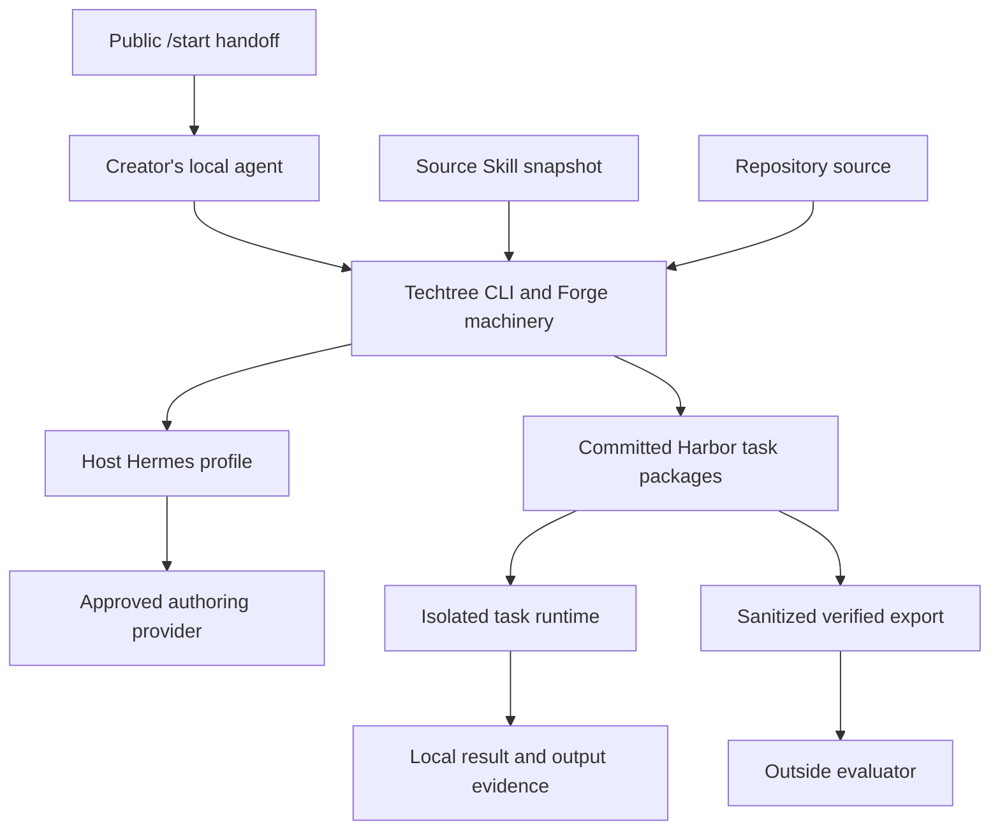
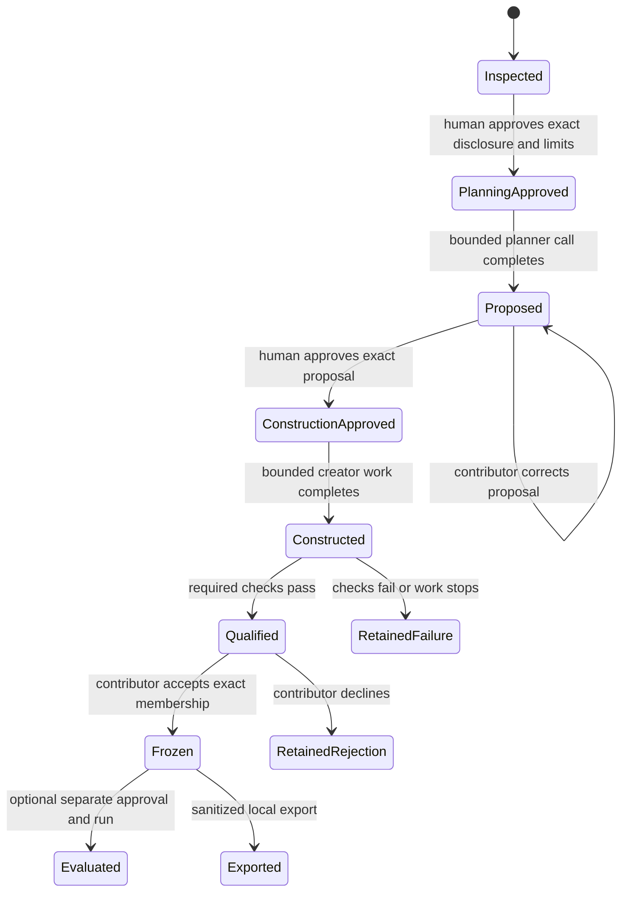
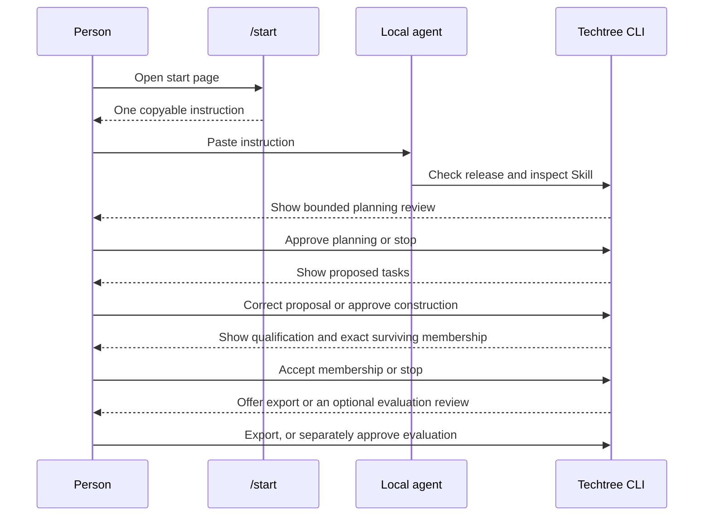
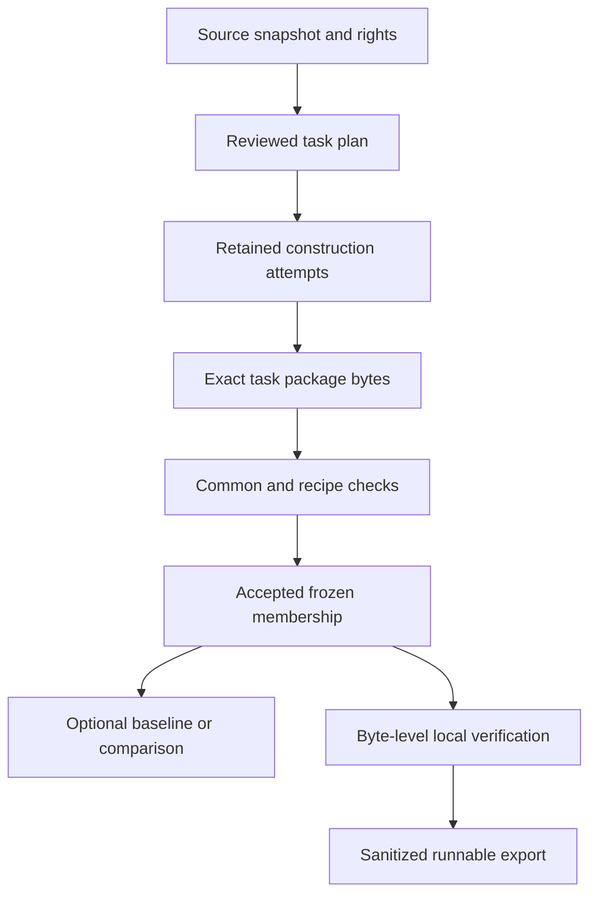

# Techtree 0.3.0 Skill-Created Environments - Plan

## Goal Capsule

- **Objective:** A practitioner can give Techtree one supported Skill, review what Techtree proposes, and finish with a qualified runnable environment that another person or agent can verify and use.
- **Means:** Add a Skill2Env-style producer to the existing Harbor-compatible Forge machinery, changing only the repository assumptions that block the first real Skill-created environment (KTD1, KTD4).
- **Product surface:** Techtree presents “Create an environment.” `forge` remains an internal CLI and code-area name.
- **Release sequence:** Finish 0.2.2 without its deferred item 1, then make this work the next feature release as 0.3.0.
- **Execution profile:** Complete U1-U6 in order with one bounded implementor/reviewer pair per codebase area, using fresh agents when the area or work type changes.
- **Stop conditions:** Stop before a model call when required Skill material is unsupported, rights or disclosure are unclear, or the prepared approval is stale. Stop before release until one outside creator and a different outside evaluator complete the release-candidate flow.
- **Shipping authority:** Local implementation, verification, and release preparation are in scope. Model runs, publication, pushing, package release, deployment, hosted execution, and production changes retain their existing explicit approval gates.

---

## Product Contract

### Summary

Techtree 0.3.0 turns a supported practitioner Skill into a reviewed, qualified Harbor task collection.
The creator can accept the environment without comparing Skills or proving positive uplift.
They can run one agent locally or export the immutable collection for someone else to verify and use.

The simplest path begins on `/start`.
The person copies one instruction to a supported local coding agent, and that agent handles installation and commands while Techtree stops for the person’s review and approval.
Direct CLI use remains available, but the public page does not teach Forge internals.

### Problem Frame

The existing repository workflow already builds, runs, and compares Harbor-style repair tasks, but its records and evidence assume Git history, historical commits, and patches.
That machinery is useful, yet more repository onboarding would not deliver the product Sean wants next.

The next product outcome is environment creation from practitioner expertise.
Repo2RLEnv and Skill2Env-style creation are peer producers; neither source passes through the other.
The common Techtree value is review, qualification, execution, verification, reuse, and later hosting.

### Key Decisions

- **Go directly to 0.3.0 Skill-created environments.** `(session-settled: user-directed — chosen over a separate 0.2.3 Forge-foundation release: Forge machinery must support the first useful environment rather than become another product milestone.)` Governs R1-R5.
- **Defer 0.2.2 item 1 instead of lowering its real-run gate.** `(session-settled: user-directed — chosen over completing the guided repository walkthrough before Skill creation: Skill-created environments are now the next feature priority.)` Governs R1-R2.
- **The environment is the primary deliverable.** `(session-settled: user-directed — chosen over making a two-arm Skill comparison the reason to create tasks: a qualified reusable environment has value before comparison.)` Governs R3-R5, R28-R31.
- **Use the existing `/start` handoff instead of building a dashboard.** `(session-settled: user-directed — chosen over a new local web application: the public page and copy-paste agent instruction can hide setup while the CLI and host retain scientific state and approval.)` Governs R10-R14.
- **Do not preselect frontend repair as the company’s first recipe.** `(session-settled: user-directed — chosen over a browser-specific launch contract: the first recipe must come from a real prospective contributor and a checkable offline outcome.)` Governs R6-R9.
- **Private hosting and managed creation follow in 0.3.x.** `(session-settled: user-directed — chosen over making hosted commerce a 0.3.0 release gate: local creation and transfer must work first.)` Governs R41-R42.

### Actors

- A1. **Creator:** the practitioner who supplies the Source Skill, reviews proposed work, accepts collection membership, and controls disclosure.
- A2. **Creator’s agent:** a supported local coding agent with terminal access that follows the copied `/start` instruction and operates Techtree on the creator’s machine.
- A3. **Techtree authoring runner:** the CLI-owned workflow that uses the approved provider through the host Hermes profile and records every phase.
- A4. **Subject agent:** the agent evaluated against a frozen environment, with no access to hidden checks, references, or authoring transcripts.
- A5. **Outside evaluator:** a person other than the creator who verifies the exported collection and runs it on a fresh supported worker.
- A6. **Release operator:** the person who assembles the candidate, records acceptance evidence, and performs only separately authorized release actions.

### Requirements

#### Release authority and product identity

- R1. The 0.2.2 release includes the already accepted items 4, 2, and 3; item 1’s guided repository walkthrough and real-run acceptance move out of that release without being represented as verified or shipped.
- R2. Preserve the uncommitted item 1 work as implementation evidence for 0.3.0, but do not commit it as accepted 0.2.2 behavior or run its deferred model and fresh-worker checks without new authority.
- R3. Techtree 0.3.0’s primary outcome is one accepted, qualified, reusable environment created from a supported Skill.
- R4. Environment creation and export must complete without a candidate Skill, comparison, positive uplift, automatic improvement, or training.
- R5. Public copy says “Create an environment” or equivalent plain language; `forge`, Harbor, Skill2Env, record types, digests, and qualification profiles appear only where technical detail is needed.

#### First contributor and supported source

- R6. Before recipe-specific implementation, Sean approves one named prospective outside creator, one Source Skill they have the right to use, and one observable offline task family derived from that Skill. This person is the creator who later completes the R43 release-candidate gate.
- R7. The selected recipe must have deterministic executable checks, a reference solution, a no-op failure, bounded local fixtures, and no live service, customer credential, runtime download, or production connection.
- R8. Frontend repair, SDK/API reliability, evidence checking, and data reconciliation remain candidate recipes; none is a 0.3.0 promise until R6 selects it.
- R9. The release supports one qualified recipe and one declared Source Skill subset; additional recipes and broader Skill dialects are deferred.

#### Human and agent experience

- R10. `/start` presents one primary action: copy a plain-language instruction to a supported local coding agent that has terminal access.
- R11. The copied instruction tells the agent to ask where the Skill is, install or inspect the pinned Techtree release, prepare each action, and stop whenever Techtree requires the person’s review or approval.
- R12. `/start` keeps the direct CLI and Hermes setup paths as secondary options and derives install coordinates from the verified release payload rather than marketing copy.
- R13. The public page remains display-only: no Skill upload, authenticated account, local-machine bridge, execution state, or approval authority is added to Phoenix.
- R14. The person sees only the current decision, the material that would leave the machine, the limits, the expected output, and the next safe action; record IDs and recovery commands remain available as secondary detail.

#### Source inspection and provenance

- R15. Techtree inventories every Source Skill file without executing it and identifies which files are admitted, unsupported, or required by the Skill.
- R16. Unsupported required scripts, binaries, symlinks, hidden files, permissions, or assets block before model calls; Techtree never silently omits them and claims the remainder is the complete Skill.
- R17. A contributor may create a reduced supported derivative, but it receives a new source identity and explicit lineage to the original snapshot.
- R18. Source Skill declarations, capabilities requested by the Skill, capabilities granted to authoring, and capabilities granted to task execution are separate facts. A declaration never grants authority.
- R19. The Source Skill used to author tasks and any Skill supplied to a baseline or candidate subject are distinct roles, each with its own recorded digest field. Identical bytes may produce equal digest values, but records and reports never merge or infer the roles from digest equality.
- R20. Every environment records source snapshot, contributor, rights declaration, recipe and prompt versions, upstream versions, authoring provider/model, granted capabilities, attempt lineage, and qualification profile.

#### Authoring, review, and recovery

- R21. Planning approval occurs before the first authoring model sees Source Skill content or approved local assets.
- R22. Planning approval binds the exact source digest, selected recipe, provider/model, disclosed files, egress, capabilities, task-count limit, call or attempt limit, wall time, and output-size limits.
- R23. The planner produces proposed tasks and success criteria, then stops for contributor review without constructing executable packages.
- R24. Contributor edits create a new proposal digest. A changed source, asset, recipe, provider/model, capability, or limit invalidates the earlier planning result or construction approval as applicable.
- R25. Construction approval binds one exact reviewed proposal and may cover its declared batch of creator calls; it does not authorize a retry, evaluation, publication, or a changed proposal.
- R26. Each operation persists a readable ID before external work, checkpoints completed phases, and retains successful, failed, rejected, interrupted, and outcome-unknown attempts.
- R27. Techtree never retries an ambiguous or failed model call automatically. A retry creates a linked attempt under a new explicit approval.

#### Qualification, acceptance, and immutability

- R28. Each generated task package contains instruction, initial workspace, environment image recipe, executable verifier, separate rubric, reference solution, limits, capabilities, and provenance. Immutable qualification evidence is stored beside the committed task tree and references its content digest; collection acceptance and export commit to both without making qualification evidence part of the bytes it verifies.
- R29. Qualification binds exact package bytes and applies common checks plus recipe-specific checks; it does not accept or freeze the collection.
- R30. Common qualification proves that a generated or imported image recipe builds without network access from release-controlled, digest-pinned base images and a bounded approved context; hidden verifier and reference material is absent from every subject-visible input and the subject image; no-op fails; the reference succeeds; output limits hold; and the task package re-hashes to its commitment.
- R31. Recipe-specific qualification includes at least one supported alternative-valid case and one intentionally invalid case when those cases are meaningful for the chosen task family.
- R32. Rubric prose and executable reward remain separate. Reports say `rubric supplied; not assessed` until an actual rubric assessor runs.
- R33. After qualification, the creator sees every proposed task and outcome, then accepts an exact qualified membership before any subject result is available. Zero qualified tasks cannot freeze; accepting one task keeps the existing small-sample warning.
- R34. Changing an instruction, fixture, image, verifier, rubric, reference, limit, capability, or membership creates a new collection version and requires the applicable checks again.

#### Run, evidence, verification, and export

- R35. A frozen environment can run one baseline without a Candidate Skill and produce task outcomes, captured outputs, failures, limits, and a local report without inventing a comparison verdict.
- R36. The record model preserves baseline-only, no-Skill-to-Skill, and Skill-v1-to-Skill-v2 modes, but comparison remains optional and separately approved.
- R37. Evaluation approval binds the frozen collection, subject harness, baseline and optional candidate Skills, provider/model, repetitions, capabilities, limits, and expected egress.
- R38. Output evidence records bounded additions, modifications, deletions, regular-file bytes, type, size, and digest immediately after subject execution and before grading. Escaping symlinks, missing required outputs, and incomplete capture are explicit failures.
- R39. Creator-side verification recomputes the Source Skill, package, membership, qualification, frozen collection, run-input, and export commitments from retained bytes rather than trusting stored status fields. Verification of a default private export recomputes every included runnable-package, qualification, membership, and export commitment while reporting the omitted Source Skill commitment as bound provenance whose private bytes were not supplied for independent re-verification.
- R40. The local environment report explains the represented work, contributor, success contract, qualification results, rejected tasks, rubric status, remaining uncertainty, exact run command, and export contents in plain language.
- R41. Export is private by default and contains the frozen runnable collection, its qualification records, verification material, provenance digests, attribution, known limitations, and rerun instructions. It excludes Source Skill bytes and private authoring transcripts unless the creator explicitly selects and has rights to include them; the report and verifier state which commitments were recomputed from included bytes and which remain provenance-only.
- R42. Publication, hosted execution, managed creation, recurring evaluation, payments, and provider-operated training are not implied by local export and remain separately approved 0.3.x work.

#### Release acceptance

- R43. The R6-approved outside creator uses the release-candidate flow on their supported Skill to review a proposal, construct tasks, inspect qualification, and accept a collection without Techtree source changes.
- R44. A different outside evaluator receives only the sanctioned export and documented prerequisites, verifies it on a fresh supported worker, and completes one baseline run without access to the creator’s machine.
- R45. The outside gate proves usability and artifact transfer, not independent scientific reproduction or positive Skill benefit. A tie, regression, or baseline-only result can pass the product gate when the environment and evidence are correct.
- R46. The 0.3.0 release notes separately report the deferred 0.2.2 item 1; qualification yield and rejected tasks; authoring attempts and interruptions; the outside creator/evaluator outcome, completion time, and support interventions; unsupported Skill material; unpriced provider usage; and every missing verification.

### Key Flows

- F1. **Start with an agent**
  - **Trigger:** A1 opens `/start`.
  - **Actors:** A1, A2.
  - **Steps:** Copy one instruction; A2 checks the pinned release and asks for the Skill path; A2 prepares the source inspection; Techtree returns the first human decision.
  - **Outcome:** A1 reaches a bounded planning review without learning Forge commands.
  - **Covers:** R10-R14.
- F2. **Create and accept an environment**
  - **Trigger:** Source inspection passes.
  - **Actors:** A1, A2, A3.
  - **Steps:** Approve planning; review or correct proposed tasks; approve construction; inspect qualification and rejected tasks; accept exact membership.
  - **Outcome:** An immutable environment exists independently of any subject result.
  - **Covers:** R15-R34.
- F3. **Recover without hidden retries**
  - **Trigger:** Planning, construction, or qualification stops or fails.
  - **Actors:** A1, A2, A3.
  - **Steps:** Discover the durable record; inspect the last completed phase and retained evidence; choose to stop or prepare a linked retry; approve any new external work.
  - **Outcome:** Evidence remains complete and no ambiguous call repeats automatically.
  - **Covers:** R24-R27.
- F4. **Run or compare**
  - **Trigger:** A frozen environment exists.
  - **Actors:** A1, A2, A4.
  - **Steps:** Choose baseline-only or comparison; review the exact evaluation plan; approve; run; inspect local results and captured outputs.
  - **Outcome:** The environment produces an honest descriptive result without making creation depend on uplift.
  - **Covers:** R35-R40.
- F5. **Transfer to another user**
  - **Trigger:** A1 chooses export.
  - **Actors:** A1, A5.
  - **Steps:** Review sanitized export contents; create export; transfer out of band; A5 imports, verifies, approves a baseline, and runs it on a fresh worker.
  - **Outcome:** The environment works without the creator’s machine or undocumented context.
  - **Covers:** R39-R42, R44-R45.

### Acceptance Examples

- AE1. **One copy-paste reaches the first decision.** Given a supported release and a local agent with terminal access, when the person copies the `/start` instruction, then the agent installs or inspects Techtree, asks for the Skill location, and presents source review without asking the person to type a Forge command. Covers R10-R14.
- AE2. **Unsupported required material blocks honestly.** Given a Skill whose instructions require a bundled script outside the admitted source contract, when Techtree inventories it, then no model call occurs and the person sees the exact unsupported file and why a derivative would be a different source. Covers R15-R17.
- AE3. **Approval is state-bound.** Given an approved three-task proposal, when the contributor changes an asset or raises the task count, then construction refuses the stale digest and prepares a new bounded review. Covers R21-R25.
- AE4. **Interrupted work remains inspectable.** Given construction completes two tasks and the provider outcome for a third call is unknown, when the process restarts, then status shows both completed packages, the unknown attempt, and no automatic retry. Covers R26-R27.
- AE5. **Qualification and acceptance stay separate.** Given five proposed tasks and one qualified task, when the creator reviews outcomes, then all five remain visible and the one task freezes only after explicit acceptance with a small-sample warning. Covers R29-R34.
- AE6. **Generic output evidence is complete.** Given a permitted task creates a binary, updates structured text, and deletes an obsolete file, when the subject finishes, then the pre-grading manifest records all three; an escaping symlink or oversized output is an explicit capture failure. Covers R38.
- AE7. **Creation succeeds without comparison.** Given an accepted collection, when the creator exports it before running a candidate, then verification succeeds and no uplift verdict is present. Covers R3-R4, R35, R39-R42.
- AE8. **Source and evaluated Skills remain distinct.** Given the same bytes are used as Source Skill and Candidate Skill, when a comparison runs, then both roles and digests appear and the report says “evaluation on Skill-derived tasks” without claiming independent generalization. Covers R19, R36-R37.
- AE9. **Transfer works without hidden context.** Given the creator’s sanitized export, when a different person imports it on a fresh supported worker, then every included runnable and evidence commitment verifies, omitted Source Skill bytes are reported as provenance-only, and one approved baseline completes without source code changes or access to the creator’s machine. Covers R41-R45.

### Success Criteria

- One real contributor reaches an accepted environment from their Skill without Techtree source changes.
- A different person verifies and runs the exported environment from a release-candidate installation.
- The person-facing path requires one copied agent instruction plus the bounded review and approval decisions; Techtree internals remain optional detail.
- The environment remains useful when no comparison is run or when a comparison ties or regresses.
- Release evidence reports qualification yield, rejected tasks, authoring attempts, interruptions, outside completion time, support interventions, and provider usage without converting unpriced usage into a dollar claim.

### Scope Boundaries

#### Included in 0.3.0

- One real Source Skill, one qualified offline recipe, one accepted environment, one baseline run, one sanitized export, and one fresh-worker reuse.
- Source-neutral task packages and output evidence only where the selected Skill path requires them.
- The current public `/start` route, existing agent prompt component, CLI review/approval machinery, Hermes profile boundary, and self-contained local reports.
- Optional comparison using the existing scientific rules after environment creation works.

#### Deferred to Follow-Up Work

- Private hosting, managed creation, maintained collections, recurring evaluation, and provider-operated training in 0.3.x.
- Additional recipes, arbitrary Skill assets, live-network tasks, more subject harnesses, rubric scoring, automatic improvement, and optimizer/proving splits.
- Marketplace listings, x402 access, payment reconciliation, bounty flows, and public collection discovery.

#### Outside This Release’s Identity

- A frontend-testing product, general website builder, design-taste grader, or comprehensive accessibility certification.
- A general environment framework completed independently of a real Skill-created environment.
- A promise that Skill-derived tasks establish generalization, statistical significance, or positive Skill benefit.
- A hosted service, automatic publisher, training platform, or repository-onboarding expansion.

### Dependencies and Risks

- The exact first contributor and Source Skill are a blocking input to recipe-specific implementation under R6. Generic framework work must not continue past U2 without that selection.
- Skill2Env and Harbor remain external dependencies under active development. The integrated revision and derived recipe must be pinned and attributed.
- Authoring uses paid or quota-limited provider inference. Existing Hermes usage may be unpriced, so controls bind calls, attempts, time, capabilities, and sizes rather than inventing a price quote.
- Generated image recipes, verifiers, and reference code are executable. Release-controlled bootstrap may acquire required digest-pinned base images before generated work begins, but generated/imported image builds and qualification run credential-free with networking disabled and a bounded approved build context.
- The schema change is a hard cut: earlier alpha Forge records remain preserved on disk but are unsupported by 0.3.0. U2 must return a named schema-version error with the record location; it must not add a legacy reader, aliases, fallback parsing, or dual output shapes.
- Outside acceptance depends on two people and a fresh worker. Their actions require scheduling and the applicable model/worker authority but not publication authority.

### Sources and Research

- Existing source-neutral commitments: `cli/src/techtree/forge/content.py`.
- Existing repository assumptions: `cli/src/techtree/forge/models.py`, `cli/src/techtree/forge/qualify.py`, `cli/src/techtree/forge/run.py`, and `cli/src/techtree/forge/service.py`.
- Existing public handoff: `platform/lib/techtree_web/live/start_live.ex`, `platform/lib/techtree_web/live/home_live.ex`, and `platform/lib/techtree_web/components/core_components.ex`.
- Existing role and approval decision: `cli/docs/decisions/0019-symmetry-approvals-ux.md`.
- Existing non-overclaim rules: `cli/docs/decisions/0035-proof-of-concept-framing.md`.
- Upstream task creation and launcher evidence: [NVlabs Skill2Env](https://github.com/NVlabs/Skill2Env).
- Peer repository producer and Harbor convergence: [Hugging Face Repo2RLEnv](https://github.com/huggingface/Repo2RLEnv).
- Source Skill format: [Agent Skills specification](https://agentskills.io/specification).
- Current release and deferred item state: `docs/plan/v0.2.2-packet.md` and `docs/handoff-2026-09-22.md`.

---

## Planning Contract

### Key Technical Decisions

- KTD1. **Build the first Skill producer directly into the existing Forge package path.** Repo2RLEnv and Skill2Env-style creation produce the same committed task-package boundary, but neither source is adapted through the other. Refactor only assumptions encountered by U2-U4.
- KTD2. **Keep `TaskContentManifest` and `TaskSetCommitment` as the common byte and membership commitments.** Add typed `repository` and `skill` provenance around them instead of inventing a second package identity. Qualification evidence remains an adjacent immutable record that references the committed content rather than entering the content tree it verifies.
- KTD3. **Use a durable append-only record chain.** Source snapshot, planning approval, plan attempt, proposal, contributor decision, construction approval, construction attempt, qualification, collection acceptance, optional evaluation, result, verification, and export are immutable referenced records; a status projection may summarize but not overwrite them.
- KTD4. **Adapt a pinned Skill2Env recipe, not its launcher.** Pin and attribute the reviewed upstream revision, follow its Harbor package and validation contracts, and replace its Codex-auth bind mount, enabled network, and relaxed container security with Techtree’s host-Hermes/profile boundary, release-controlled base-image acquisition, network-disabled generated builds, and isolated task runtime.
- KTD5. **Use three external-work approvals and a separate collection decision.** Planning and construction approvals cover bounded phases, collection acceptance freezes qualified membership, and evaluation approval covers an optional subject run. `--yes` continues only the exact prepared phase and is never agent self-approval.
- KTD6. **Keep Source Skill inspection inert.** Inventory and hash source files on the host, disclose admitted bytes before provider egress, and never execute source scripts. Generated environment recipes build with networking disabled from a bounded approved context; verifier and reference code execute only in the approved isolated workflow.
- KTD7. **Capture generic outputs before grading.** Store a bounded manifest of additions, changes, deletions, bytes, types, sizes, and digests; retain Git patches only as additional repository-task evidence.
- KTD8. **Split common and recipe qualification.** The common profile owns package, image, isolation, no-op, reference, commitment, and limit checks; the selected recipe owns its alternative-valid and intentionally-invalid cases.
- KTD9. **Keep evaluation roles explicit.** Baseline and candidate Skills are independently optional according to decision 0019, while Source Skill provenance stays on the environment. Comparison requires compatible frozen membership and configuration.
- KTD10. **Use `/start` as a handoff, not a control plane.** `(session-settled: user-directed — chosen over a new local browser UI: existing prompt blocks, release-derived commands, CLI reviews, and host approvals already form the shortest safe path.)` Phoenix remains display-only and stores no local workflow state.
- KTD11. **Default exports to runnable bytes without source disclosure.** Include content and qualification commitments plus attribution, but add Source Skill bytes only through a separate explicit selection backed by rights. Export verification distinguishes commitments recomputed from included bytes from Source Skill provenance whose bytes remain private.
- KTD12. **Keep 0.3.0 local-first.** The platform advertises and explains the workflow; scientific state, execution, verification, and export remain CLI-owned. No database resource, authenticated mutation, or Ash action is needed for the `/start` change.

### High-Level Technical Design

These diagrams show ownership and protocol boundaries, not exact class or function designs.

#### Component topology

#### Creation lifecycle

#### Human and agent handoff

#### Environment data flow

### Sequencing and Change Boundaries

1. U1 records the release deferral, chooses the real source, and pins the upstream contract before production code.
2. U2 proves one imported task and removes only the Git assumptions that prevent that package from entering the common commitment and qualification path.
3. U3 adds Source Skill planning and construction with durable approvals and retained attempts.
4. U4 completes qualification, acceptance, baseline execution, verification, and export before optional comparison polish.
5. U5 replaces public setup copy with the one-instruction environment flow while keeping Phoenix display-only.
6. U6 runs the creator/evaluator gates, reconciles release truth, and prepares 0.3.0.

Do not start U3’s recipe-specific implementation until U1 has an approved contributor and Skill.
Do not start U5’s release copy before U4’s commands and result language are stable.

### Implementation Constraints

- Follow `AGENTS.md`, `cli/CLAUDE.md`, `regent-workflow`, and the repository’s no-shim hard-cut rules.
- Preserve the working repository producer. Do not add new repository-specific product features.
- Keep business and scientific rules in the CLI. Phoenix LiveViews render release-derived copy and do not acquire workflow authority.
- Use the existing Regent UI tokens, prompt block, command block, focus states, copy feedback, mobile stacking, reduced motion, and forced-color support.
- Do not introduce a frontend framework, workflow framework, vector database, notebook editor, or general orchestration layer.
- Do not read or copy provider credentials. Never mount auth files into authoring or task containers.
- Do not generate smoke tests, mocks of internal modules, source-text assertions, decorative copy tests, or tests that mirror implementation.

---

## Implementation Units

### U1. Lock release authority and the first real source

- **Goal:** Remove deferred 0.2.2 item 1 from release acceptance and select the one real contributor, Skill, rights statement, and offline task family that 0.3.0 will support.
- **Requirements:** R1-R9.
- **Files:** `docs/plan/v0.2.2-packet.md`, `docs/plan/techtree-market.md`, `docs/handoff-2026-09-22.md`, the selected source record under the existing evidence layout, and attribution/licensing documents required by the chosen upstream recipe.
- **Approach:** Preserve the item 1 worktree unchanged as evidence. Record why its real run was deferred. Inspect candidate Skills without provider calls, reject candidates with unavailable rights or unbounded live dependencies, and obtain Sean’s approval for the named source before U3.
- **Test scenarios:**
  - A candidate with clear rights and an offline observable outcome produces a bounded source/recipe decision.
  - A candidate that requires live credentials, unsupported required assets, or unclear redistribution rights is rejected before model calls.
  - The 0.2.2 packet and handoff point to this plan and no longer instruct the next agent to run item 1.
- **Verification:** Review the exact Git diff and confirm the preserved item 1 worktree fingerprint and files remain unchanged.
- **Done:** One named source is approved, release authority is unambiguous, and no 0.2.2 item 1 real run or commit has occurred.

### U2. Prove the common environment-package boundary

- **Goal:** Import and qualify one pinned Skill2Env task package without repository metadata, then make only the model changes that this proof requires.
- **Requirements:** R20, R28-R32, R34, R38-R39.
- **Files:** `cli/src/techtree/forge/models.py`, `cli/src/techtree/forge/content.py`, `cli/src/techtree/forge/qualify.py`, `cli/src/techtree/forge/service.py`, a small `cli/src/techtree/forge/skill2env.py` integration, and separately pinned resources following `cli/src/techtree/forge/bundle.py` and `cli/src/techtree/resources/forge/`.
- **Approach:** Pin the reviewed Skill2Env revision and Harbor dependency. Materialize its task into the existing content commitment, store qualification as an adjacent immutable record, add typed source and qualification branches, and refuse fake commits or empty repository fields. Acquire trusted base images through the release-controlled bootstrap, then build the generated/imported recipe with networking disabled and a bounded context that rejects remote contexts, frontends, and fetch-capable `ADD` sources. Keep the repository producer entering the same package boundary.
- **Test scenarios:**
  - A pinned non-Git task commits and qualifies with Skill provenance and no repository or commit field.
  - The equivalent repository task still qualifies under its existing profile.
  - A changed package byte fails re-verification before run.
  - A no-op pass, reference failure, subject-visible hidden-material leak, unsupported schema, or missing provenance rejects the task with retained evidence.
  - An image recipe that attempts network access, a remote build context/frontend, or a remote `ADD` fails before qualification passes.
  - A pre-cut alpha record remains preserved but returns the named unsupported-schema error without partial or fallback parsing.
- **Verification:** Extend focused existing Forge tests, run the imported task model-free, and run `make -C cli check` plus `make -C cli test-integration` when the touched boundary warrants it.
- **Done:** One non-repository task and one repository task use the same committed package boundary with source-appropriate adjacent qualification, offline generated builds, an explicit alpha-record cutover, and no fabricated Git facts.

### U3. Create an environment from the selected Skill

- **Goal:** Turn the approved Source Skill into reviewed proposals and generated task packages through bounded, recoverable authoring phases.
- **Requirements:** R15-R27.
- **Files:** `cli/src/techtree/forge/skill.py`, `cli/src/techtree/forge/models.py`, `cli/src/techtree/forge/service.py`, `cli/src/techtree/forge/profile.py`, `cli/src/techtree/forge/skill2env.py`, `cli/src/techtree/cli/commands/forge.py`, and the selected pinned authoring resources.
- **Approach:** Add the durable record chain and exact planning/construction reviews. Reuse host Hermes profile locking and reset rules in a distinct authoring workspace. Persist an ID before each external phase, and keep every proposal and attempt.
- **Test scenarios:**
  - A supported Source Skill reaches a proposed bounded task plan, then stops before construction.
  - A changed source file, allowed asset, provider/model, task count, or capability invalidates the prepared action.
  - Contributor corrections create a new proposal digest and do not overwrite the original.
  - An interrupted or outcome-unknown call remains visible and cannot retry without a new approval.
  - An unsupported required file blocks before provider egress with the exact file named.
- **Verification:** Exercise prepare/decline/approve/correct/interruption paths with model-free fixtures first. Run the first real planner and creator calls only under separately announced founder authority and retain their complete local evidence.
- **Done:** The selected real Skill produces task packages through reviewed proposals and bounded authoring, with no hidden retry, credential copy, or discarded attempt.

### U4. Qualify, accept, run, verify, and export

- **Goal:** Complete the environment as a useful artifact before comparison: qualify exact bytes, accept membership, run one baseline, verify locally, and create a sanctioned export.
- **Requirements:** R28-R42.
- **Files:** `cli/src/techtree/forge/qualify.py`, `cli/src/techtree/forge/run.py`, `cli/src/techtree/forge/experiment.py`, `cli/src/techtree/forge/compare.py`, `cli/src/techtree/forge/report.py`, `cli/src/techtree/forge/models.py`, `cli/src/techtree/cli/commands/forge.py`, and a narrow export/verification module if existing ownership cannot contain it cleanly.
- **Approach:** Add recipe evidence, explicit collection acceptance, generic pre-grading output capture, byte-level creator verification, a baseline-only report, and private-by-default export verification that is explicit about omitted source bytes. Adapt optional comparison to role-based Skills without making it a creation gate.
- **Test scenarios:**
  - Partial qualification requires explicit membership acceptance and preserves every rejection.
  - Editing any accepted package byte or membership fails verification and prevents evaluation/export under the old identity.
  - A baseline-only run produces outcomes and artifacts without a comparison verdict.
  - No-Skill-to-Skill and Skill-v1-to-Skill-v2 comparisons use compatible frozen membership and distinct role digests.
  - A binary addition, structured-text change, deletion, oversized output, and escaping symlink receive the R38 outcomes.
  - A default export omits Source Skill bytes and authoring transcripts, verifies every included runnable and evidence commitment, and reports the Source Skill commitment as provenance-only.
- **Verification:** Extend `cli/tests/fixtures/forge/support.py` and the existing Forge test files only for the named invariants. Run focused suites, `make -C cli check`, and the selected environment’s real reference/no-op/baseline flow under applicable authority.
- **Done:** The real environment freezes, verifies, runs once, and exports without requiring a candidate or exposing private source material.

### U5. Make `/start` the one-instruction handoff

- **Goal:** Let a person begin environment creation by copying one plain instruction to their local agent while retaining direct CLI/Hermes setup as secondary detail.
- **Requirements:** R5, R10-R14, R40.
- **Files:** `platform/lib/techtree_web/live/start_live.ex`, `platform/lib/techtree_web/live/home_live.ex`, `platform/lib/techtree_web/controllers/skill_controller.ex`, `platform/lib/techtree_web/components/layouts.ex`, `platform/priv/static/llms.txt`, `plugin/skills/operator/SKILL.md`, and existing focused tests under `platform/test/techtree_web/` and `cli/tests/plugin/`.
- **Approach:** Reuse `prompt_block`, release-derived setup commands, the ruled page, and the existing CLI/host approval surfaces. Replace Hello World and “approve, then compare” as the primary path with “bring a Skill, review the plan, create an environment.” Add no local browser server, workflow state, upload form, account, or Phoenix mutation.
- **Test scenarios:**
  - The installable channel renders one copyable agent instruction, direct CLI/Hermes alternatives, and the exact release-derived coordinates.
  - An unavailable channel gives no placeholder command and explains what is missing.
  - The copied instruction reaches the first source review through a supported local agent without requiring the person to type a Forge command.
  - Keyboard, screen-reader copy feedback, 320px mobile layout, dark/light themes, reduced motion, clipboard failure, and long Skill paths remain usable.
  - The page never claims that it executed work, approved spend, uploaded a Skill, or published an environment.
- **Verification:** Run focused LiveView/controller/plugin contract tests and a real browser pass at mobile and desktop sizes. Preserve shared Regent UI assets rather than editing generated copies.
- **Done:** A new person can reach the first bounded review from `/start` through one copied instruction, and all scientific or approval state remains local.

### U6. Complete outside acceptance and prepare 0.3.0

- **Goal:** Prove creator usability and artifact transfer on release-candidate bytes, then reconcile every public and package claim.
- **Requirements:** R43-R46.
- **Files:** release version and lock files, `CHANGELOG.md`, `platform/priv/changelog.md`, release bootstrap/catalog inputs, README and architecture copy, site copy affected by the new identity, and evidence under the existing 0.3.0 artifact convention chosen by the release operator.
- **Approach:** Build the release candidate reproducibly. Guide one outside creator through F1-F3 and a different evaluator through F5 without source changes. Record interventions and failures. Fix product defects through renewed implementation and review before repeating the affected gate.
- **Test scenarios:**
  - The creator completes source review, planning, construction, qualification, and acceptance using only released instructions.
  - The evaluator verifies the exact export and completes a baseline on a fresh supported worker without creator-machine access.
  - A tie, regression, or baseline-only result leaves the product gate eligible when artifacts and claims are correct.
  - Missing private assets, unsupported host requirements, package drift, or an incomplete export fails plainly rather than downloading or guessing.
  - Release notes disclose the deferred 0.2.2 item 1; recipe limit; qualification yield and rejected tasks; attempts and interruptions; outside completion time and support interventions; unpriced usage; and remaining exclusions.
- **Verification:** Run focused component gates, `make check`, deterministic wheel verification, fresh-install CLI and plugin checks, the two outside flows, and site/browser checks. Record any protected release action as still pending until separately authorized.
- **Done:** All model-free and authorized real gates pass on the exact candidate, the outside creator and evaluator complete, public claims match evidence, and no abandoned implementation attempt remains in the accepted diff.

---

## Verification Contract

| Gate | Applies to | Required evidence |
| --- | --- | --- |
| Focused Forge unit tests | U2-U4 | Existing Forge suites cover typed source validation, package drift, approvals, retained attempts, qualification, generic outputs, baseline reporting, and role-based comparisons without decorative coverage. |
| `make -C cli check` | U2-U4 and U6 | CLI formatting, typing, unit, contract, release, and policy checks pass. |
| `make -C cli test-integration` | U2-U4 and U6 when integration boundaries change | Real local container/package paths pass with isolated infrastructure. |
| `make -C cli check-plugin` | U5-U6 | Plugin contracts and operator guidance agree with the CLI and release. |
| Focused Phoenix tests | U5 | `platform/test/techtree_web/live/start_live_test.exs`, `home_live_test.exs`, controller tests, and release-copy tests pass. |
| Browser verification | U5-U6 | `/start` works with keyboard, screen reader semantics, clipboard fallback, mobile and desktop layout, light/dark themes, and reduced motion. |
| Pinned upstream import | U2 | One Skill2Env task qualifies under recorded upstream and Harbor versions without Git metadata, unsafe launcher behavior, or network access during the generated/imported image build. |
| Real authoring flow | U3-U4 | Under announced authority, the selected Skill produces retained planning/construction evidence, qualified tasks, accepted membership, a baseline result, verification, and export. |
| Interruption exercises | U3-U4 | Planning/construction and subject execution interruptions retain discoverable evidence and never auto-retry ambiguous calls. |
| Full repository gate | U6 | `make check` passes on the exact release candidate. |
| Outside creator gate | U6 | One non-team creator completes the release-candidate creation flow without Techtree source changes. |
| Outside evaluator gate | U6 | A different person verifies and runs the sanctioned export on a fresh supported worker. |

New automated coverage must protect a named requirement or observed regression.
Do not add smoke tests, internal mocks, source-text checks, decorative copy assertions, or tests that repeat product code.
Real model and fresh-worker checks supplement rather than replace deterministic gates, and they require the applicable approval at execution time.

---

## Definition of Done

### Global

- R1-R46 are satisfied on the same exact reviewed release-candidate revision.
- The creator can obtain and accept a qualified environment without running a comparison.
- `/start` reaches the first human decision through one copied agent instruction, with direct CLI/Hermes use still available.
- Creator-side verification recomputes the Source Skill, task packages, qualification, frozen membership, run inputs, outputs, and export from retained bytes. Default-export verification recomputes every included commitment and truthfully marks omitted Source Skill bytes as unavailable for independent re-verification.
- Every failed, interrupted, rejected, and outcome-unknown attempt remains inspectable; no retry or publication occurs implicitly.
- One outside creator and a different outside evaluator complete the required flows without source changes or positive-uplift assumptions.
- The working repository path still passes its applicable checks, but no new repository-specific product scope was added.
- Public claims, changelog, version files, package metadata, bootstrap data, plugin core, and site copy describe the same proven product.
- Abandoned experimental code and superseded copy are absent from the accepted diff.
- Push, publication, package release, deployment, hosting, and other protected actions remain pending until explicitly authorized.

### Per unit

- **U1:** 0.2.2 item 1 is formally deferred, its work is preserved, and the named 0.3.0 contributor/source/recipe is approved.
- **U2:** A pinned non-Git package and the existing repository package share one honest committed boundary and qualify under typed profiles.
- **U3:** The selected Skill produces reviewed proposals and retained constructed packages under exact bounded approvals.
- **U4:** Exact task bytes qualify, accepted membership freezes before subject results, and the environment runs, verifies, and exports without comparison.
- **U5:** The public handoff is one-instruction simple, accessible, release-derived, and carries no scientific or approval state.
- **U6:** The exact release candidate passes repository gates plus the distinct outside creator and evaluator acceptance flows.
