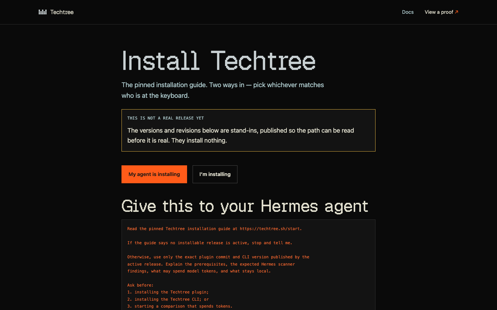

# Techtree Hermes Plugin

[](LICENSE) [](https://www.python.org/downloads/) [](https://techtree.sh/start)



*The pinned installation guide at techtree.sh/start — the only supported way
in.*

## Give this plugin to your Hermes agent

Paste this into Hermes:

> Read this plugin directory's pinned Hello World installation instructions.
> Explain the exact commands, the prerequisites, what spends model tokens,
> and the privacy terms. Ask before installing the plugin, installing
> regents, or starting a run that spends tokens. After the
> plugin is enabled, tell me when to restart Hermes, then continue with
> Techtree Doctor and the Hello World Climb.

> [!IMPORTANT]
> Techtree is a working technical preview of a stack of three independent
> parts: Prime Intellect's Verifiers as the evaluation engine,
> Nous Research's Hermes as the agent host, and
> Techtree as the campaign kernel and evidence layer.
> What it demonstrates is that the three pin together tightly enough for a
> controlled comparison to run end to end and leave a receipt that verifies
> offline.

```text
        you
         │  one pasted prompt
         ▼
   Hermes (operator) ······ plugin/               ◀ this component
         │  fixed argv · one JSON answer
         ▼
   regents techtree ······· regents-cli, its own repository
         │  pinned engine, detached runs
         ▼
   Verifiers evaluation ··· (Prime Intellect, pinned to an exact commit)
         │  model calls, paid by the participant
         ▼
   subject: hermes-agent + pinned model, in a pinned container
         │
         ▼
   signed report · proof that verifies offline

   platform/ ─ the site: pinned guide, catalog, published objects, run log
```

## Other components

- **[regents-cli](https://github.com/regents-ai/regents-cli)** — the `regents`
  command. Its `regents techtree` commands are the campaign kernel and
  evaluation substrate: campaigns, detached runs, signed comparison reports,
  and offline proof verification. Everything a comparison measures and records
  happens there, on the participant's own machine. It is installed with
  `uv tool install regents-cli`.
- **[Public platform](../platform/)** — the website
  at techtree.sh: the pinned installation guide, the campaign catalog, the
  published protocol objects, the public run log, and the docs. Everything it
  shows is served over GET. It has one address that accepts anything, and what
  that address accepts is a signed run somebody chose to publish.

| Layer | What | Pin |
| --- | --- | --- |
| Evaluation engine | Prime Intellect's Verifiers | pinned to an exact commit |
| Agent host | Nous Research's Hermes, the operator | host Hermes 0.21.3 or newer |
| Evaluated subject | hermes-agent, in a pinned container | v2026.9.24 (0.21.5) |
| Subject model | openai/gpt-6-luna at high reasoning, reached through prime | named by the Campaign |
| Campaign kernel and evidence | `regents techtree`, from regents-cli | Python 3.12, managed with uv |

Techtree runs a neutral agent and a Skill-enabled agent against the
same toy tasks, shows the measured difference, and creates a signed
local receipt you can verify offline.

This plugin is the operator surface for that: it lets Hermes inspect what a
Climb measures, prepare a run, start it, follow it, and read the result.

## Repository experiments and Skill environments

The plugin has no tools for building tasks from a repository or for creating
an environment from a Skill. Both run through
`regents` in a terminal, as `regents techtree forge` commands. The bundled operator
Skill tells Hermes how to walk a person through creating an environment: ask
where the Skill is and never pick one, run one step at a time, show each
review exactly as Techtree prints it, and run an approving command only after
the person says yes to that review. Planning and building send the Skill's
files to the model provider the person chose, on their own sign-in. The steps
are listed on the agent page at
[techtree.sh/skill.md](https://techtree.sh/skill.md).

> [!NOTE]
> Techtree uploads nothing unless you publish a run yourself. Publishing uploads
> the complete proof bundle — manifests, signed report and receipts, cited
> documents, and any optional execution record — while Episodes and Traces
> remain local. Model inference is still sent to the model provider you
> configured, under that provider's policies — a comparison that runs locally
> is not a comparison that runs without the network.

The evaluated agent is never the Hermes you are talking to. It is a separate,
pinned agent in a container that receives only what the Climb declares.

The guided introduction is **Techtree Hello World** (`hello-world-climb@1`), a
toy Skill-uplift Climb: it runs the synthetic BranchCode v1 task family with
and without the `hello-world-starter-v1` Skill. It shows how the mechanism
works. It is not a measure of broad capability.

## Install

> [!WARNING]
> Starting a comparison spends model tokens against your own provider credit.
> Nothing causing LLM token spend starts on its own: installing the plugin,
> installing regents, and starting a run that spends are three separate approvals,
> and each one waits for you to answer.

Install only from the exact pinned guide at
[techtree.sh/start](https://techtree.sh/start). The guide reads the install
vector from the active BootstrapRelease, links the exact 40-character plugin
commit, and shows the command argument for argument. Do not copy a branch name,
a floating package version, or an example placeholder into an install command.

**On Hermes 0.21.3, expect Hermes to refuse the first attempt.** It reads the
source before installing anything, this plugin comes back at caution there, and
a community-source plugin at caution is refused rather than queried. That is not a fault and the
step past it is a decision you make after reading what the scan found — see
[Install-time security scanning](#install-time-security-scanning) below.

Supported host: Hermes 0.21.3. The evaluated subject remains the separately
pinned Hermes v2026.9.24 (0.21.5) named by the Campaign. The release this plugin belongs to
is recorded in `release-core.json`.

Installing the plugin does not install regents, the command that runs
Techtree. Ask in the
conversation — "is Techtree ready?" — and the plugin will tell you what is
missing and show you the exact command to install it. That command always
needs your approval and installs only the version pinned by the same release.

After the plugin is installed and enabled, restart Hermes once so the tools
load. The plugin then asks again before installing regents. Spending
tokens on a comparison has its own separate approval after Doctor and the run
review.

## Install-time security scanning

Hermes reads a plugin's source before installing it and shows you what it
found. This plugin comes back at **caution** on Hermes 0.21.3 and at **safe**
on Hermes 0.21.4, with the same fourteen findings in ten files either way.
Not one of them is an oversight waiting to be tidied away: each is part of how
the plugin does its work or proves it, and each is a few lines you can read for
yourself before you approve anything.

- **The guard's own list of command words** — `cli/guards.py`, reported as
  privilege escalation. It is the deny-list: the words the guard looks for in
  text a model wrote beside a result, so wording that would have someone
  install a package, open a shell, or take administrator rights is refused. A
  list of what to refuse has to name the things it refuses.
- **Three places the plugin starts regents** — `cli/bridge.py`, reported
  as execution. Those three are the entire boundary between this plugin and
  Techtree. Each starts the one command named in `cli/constants.py`, with a fixed
  argument list, no shell, a named list of environment variables rather than
  everything the session holds, and one JSON answer read back. There is no
  fourth.
- **The control-character stripper** — `host/channels.py`, reported as
  obfuscation. One pattern, matching terminal control codes, so they can be
  taken out of anything the plugin puts into a conversation.
- **The plugin's own tests and checkers** — `tests/` and `scripts/`, nine
  findings reported as execution, supply chain, privilege escalation and
  destructive commands. The tests start real processes to prove the bridge
  builds the command it claims to, and the guard tests carry the very
  sentences the guard refuses — a download piped into a shell, an
  administrator command, a disk-wiping command hidden in a version string.
  None of it runs when the plugin loads or when a tool is called.

### Hermes refuses this install the first time, and that is expected

It does not stop and ask. A plugin from a community source that comes back at
caution is refused outright, and the refusal names what would override it:

```text
Security scan blocked plugin install: Requires confirmation (caution verdict, 14 findings)
```

So installing is two deliberate steps rather than one. Run the pinned command
from [techtree.sh/start](https://techtree.sh/start) first and read what the
scan reports. If it is the fourteen findings above, in the files above, and
you have looked at the code they name, run the same command again with
`--force` appended.

`--force` deserves a sentence of its own, because Hermes's own `--help`
describes it only as "Remove existing plugin and reinstall" and says nothing
about a security decision. Overriding the scan is its second job. It applies
to the one install you run it on and to nothing else, and it leaves the
scanning switched on for every plugin you install afterwards.

Do not switch the scanning off. It is the one look at the source that happens
before the code is on your machine, and this plugin has nothing to hide from
it: everything the scan reports is described above, and the refusal itself is
the scanner working rather than a fault to route around.

## What loading the plugin does

It reads two files that shipped inside the plugin, then tells Hermes which
tools exist. That is the whole of it.

Loading the plugin never installs software, never reaches the network, never
starts Docker, never runs Techtree, and never calls a model. This is enforced
by a test that seals off every way of starting a process, opening a socket, or
writing a file, and then requires the plugin to load anyway. It lives with the
rest of the plugin's suite in this directory, as
`tests/contract/test_no_registration_side_effects.py`.

## Commands

In any session:

| Command | What it does |
| --- | --- |
| `/techtree setup` | is Techtree installed, and is this machine ready? |
| `/techtree climbs` | what this build offers |
| `/techtree demo` | prepare Techtree Hello World, stopping before it spends |
| `/techtree status` | how a run is going |
| `/techtree cancel` | stop a run |
| `/techtree result` | the finished result |
| `/techtree verify` | check a local proof, offline |

In a terminal, where regents' own rendered output belongs:

| Command | What it does |
| --- | --- |
| `hermes techtree doctor` | is this machine ready to run a Climb? |
| `hermes techtree demo` | prepare Techtree Hello World |
| `hermes techtree status <run>` | how a run is progressing |
| `hermes techtree result <run>` | the finished report for a run |
| `hermes techtree verify <path>` | check a local proof, offline |

Everything this plugin adds to your terminal sits under the one word
`techtree`, so nothing here takes a name of its own alongside Hermes' own
commands. `hermes techtree` on its own lists what you just read.

## Check the plugin

```bash
make doctor
```

Reports whether this build is sound — its manifest, its tool descriptions, its
release bytes, and whether its code stays within the standard library — and
whether `regents` and `uv` are present on this machine. A missing `regents` is
a warning with a next step, not a failure: the plugin is meant to work on a
machine where regents was never installed.

## How it talks to Techtree

Every scientific thing this plugin can cause happens by running
`regents techtree` with a fixed list of arguments and reading back one JSON
answer. There is no second path: no shell and no imported regents code. This plugin reaches
no network either — no module of it imports a networking library, and the
plugin doctor proves that by reading every runtime import rather than by
promising it. The regents command it runs is what talks to the run log, and
only after the person has said yes.
The plugin adds `--json` itself, so an answer is never coloured or
interactive, and it accepts exactly one well-formed answer — anything else is
treated as the two sides disagreeing about the contract rather than something
to guess at.

That command is also given a short, named list of environment variables and
nothing else: where to find programs, the home directory regents keeps its
state under, a temporary directory, the language settings, and the kind of
terminal. A Hermes session carries whatever the person who started it had
exported, and almost none of it is Techtree's business. The list is `CLI_ENVIRONMENT_ALLOWLIST` in `cli/constants.py`, short
enough to read in one go.

The plugin and the installed regents also have to belong to the same release.
Both carry the identical `release-core.json`, published under the SHA-256 of
the file itself, so agreement can be checked by asking the installed regents
what release it belongs to:

```bash
make release-core-cli
```

## Repository layout

```text
plugin.yaml          what the host reads: name, tools, hooks
release-core.json    the release this build is pinned to (generated)
__init__.py          registration
cli/constants.py     fixed values; no mutable state
cli/errors.py        plugin-local errors and their stable codes
services/models.py   local models and strict parsers
host/schemas.py      the model-visible tool schemas
cli/release.py       the pinned release, its digest, and its cross-checks
cli/bridge.py        the only path from the plugin into regents
cli/doctor.py        the plugin's own doctor
cli/bootstrap.py     installation after a person has said yes
cli/guards.py        checks on model-written wording
host/commands.py     `/techtree` and `hermes techtree ...` registries
host/hooks.py        session lifecycle registry
host/channels.py     how compact an answer has to be
host/state.py        the identifiers a conversation keeps
services/narrative.py fixed presentation wording
services/approvals.py approval and plan records
tools/               the tools the agent calls
services/            the container assembled during registration
skills/              bundled read-only operator Skills
tests/               the plugin's test suite: unit, contract, integration
scripts/             the plugin's own checkers: doctor, schemas, release bytes, types
```

Everything above `tests/` is the plugin package. The tests and checkers sit
beside it, and a suite that proves the guards work has to carry the attacks
they catch, which is what the install-time scan reports from those two
directories.

## Development

```bash
make install    # sync the tooling environment
make check      # format, lint, types, tests, and the plugin doctor
```

The plugin runtime uses only the Python standard library, and never imports
regents' Python package: the regents JSON answer is the only boundary
between the two. The plugin doctor fails the build if that stops being true.

The contract tests that ask a real regents read-only questions run when
`REGENTS_CLI_ARGV` names the command to run:

```bash
make test REGENTS_CLI_ARGV=regents
```

## What it remembers

Only identifiers: which draft, which run, which proof — never a key, never a
Skill's text, never anything from inside a run. They live for the length of
the conversation, and nothing is lost when it ends, because Techtree holds the
run itself: ask about a run by its identifier and the answer comes back from
Techtree, not from anything the plugin was keeping.

## Bounded answers

Everything answers in the conversation itself. Those answers are
compact, carry no terminal control codes, and are bounded — and when an answer
is cut, it says so and names the command that shows all of it. When nothing
tells the plugin how much room it has, it assumes the smaller budget, because
an answer that fits a narrow window is also fine in a wide one.

## What it writes, and turning it off

The plugin writes nothing to disk. What it remembers lives in the
conversation and is gone when the conversation is: it keeps draft
identifiers, run identifiers and proof paths in memory for the length of a
session, and writes no configuration file, no cache, no log, and no credential
anywhere.

### Disabling

```bash
hermes plugins disable techtree
```

The tools, the `/techtree` command and the session hooks stop being offered.
Nothing on disk changes.

### Removing

```bash
hermes plugins remove techtree
```

That removes the plugin, and it leaves nothing of its own behind.

Two things are deliberately **not** removed by either command, because they are
not the plugin's to delete:

- **Techtree's own home** — your runs, drafts, proof bundles and the evaluation
  engine, in `~/.regents/techtree`. It belongs to regents, not to this plugin.
  Remove regents with `uv tool uninstall regents-cli`, which removes the
  `regents` command for every Regents site and not only Techtree, and delete
  that home if you want it gone.
- **Anything held by your model provider.** An evaluated run sends its tasks
  to the provider the run is configured with. What providers retain is
  governed by their policies, and no command here reaches it.

## Release status

This directory carries the release contract in `release-core.json`, release
`climb-v0.5.0`, with host Hermes 0.21.3 as its minimum. It names the
starter Skill for each Climb, so the installed plugin can prepare Techtree Hello
World and run its comparison. Earlier records required Hermes 0.20.1, and each record's own
minimum applies to the plugin commit it installs.
Which plugin commit is installable is decided by the active
release that [techtree.sh/start](https://techtree.sh/start) publishes;
repository presence alone is not a public release signal. The monorepo
[README](../README.md#release-compatibility) lists every released plugin commit
beside its CLI version and catalog.
